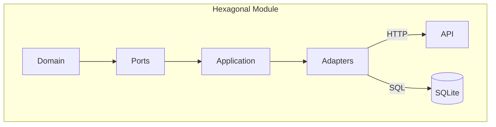

# Forum (Go Modular Monolith)

[](https://golang.org)
[](https://sqlite.org)
[](LICENSE)
[](https://github.com/ertval/forum/actions)

A lightweight, self-hosted community forum with zero external dependencies. Designed for developers who want full control over their discussion platform without proprietary SaaS lock-in.

A web forum built with Go using **Hexagonal Architecture (Ports & Adapters)** in a **modular monolith**.

- **Language**: Go 1.24+
- **Database**: SQLite (`mattn/go-sqlite3`, CGO enabled)
- **Entry point**: `cmd/forum/main.go`
- **Composition root**: `cmd/forum/wire/`

---

## What is implemented

### Core modules (complete)
- `auth` — register/login/logout, session validation, one active session per user
- `user` — user profile + user stats
- `post` — CRUD, categories, filtering, image upload
- `comment` — CRUD + ownership validation
- `reaction` — like/dislike toggles on posts/comments

### Scaffolded optional modules
- `moderation`
- `notification`

### Platform layer (complete)
- config, database connection, migrator, HTTP server + middleware, logger, validator, upload, health checks

For implementation status details: `docs/IMPLEMENTATION_ROADMAP.md`.

---

## Non-negotiable project rule

### Public IDs must be UUIDs
Internal DB IDs are integers, but **never expose sequential IDs** in URLs, templates, JSON, or request context.

- Use `PublicID` externally
- Keep integer IDs internal to persistence and domain relations

---

## Architecture

Hexagonal (ports-and-adapters) Go monolith:
- Core domain: threads, posts, user auth
- Adapters: PostgreSQL, REST API, WebSocket
- No framework — standard library + gorilla/mux



Each module follows this strict structure:

```text
internal/modules/{module}/
├── domain/      # entities + business rules (stdlib only)
├── ports/       # input/output interfaces
├── application/ # use-case orchestration
└── adapters/    # HTTP handlers + SQLite repositories
```

Dependency direction:

- `adapters` -> can import `application/ports/domain`
- `application` -> can import `ports/domain`
- `ports` -> can import `domain`
- `domain` -> no project-layer imports

Detailed reference: `docs/ARCHITECTURE.md`.
New contributors should start with the `docs/guides/ONBOARDING_GUIDE.md`.
---

## Quick start (local)

### Prerequisites
- Go 1.24+
- CGO toolchain (required by SQLite driver)
- `sqlite3` CLI (for seeding scripts)

### Run

```bash
make go
```

The app starts on:
- HTTP: `http://localhost:8080`
- HTTPS: `https://localhost:8443` (only if cert/key files exist)

### Devcontainer note

Some devcontainers do not include Docker Engine/CLI access. If `make up` prints a Docker/Compose availability error, run Docker commands from your host terminal instead.

### Seed test data (optional but useful)

```bash
make seed
```

This runs migrations first, then loads seed data.

---

## Docker

### Using Docker Compose (recommended)

```bash
make up        # start
make down      # stop
```

`make up` now auto-detects `docker compose` (preferred) and falls back to `docker-compose` when available.

Compose exposes `8080` (HTTP) and `8443` (HTTPS) and mounts `./data`, `./static/uploads`, and `./certs`.

### Using plain `docker run`

```bash
# Build the image
docker build -t forum .

# First run — create a named container with volumes for data persistence
docker run -d --name forum -p 8080:8080 \
  -v forum-data:/app/data \
  -v forum-uploads:/app/static/uploads \
  forum

# Stop
docker stop forum

# Start again (reuses the same container and data)
docker start forum

# View logs
docker logs -f forum

# Remove the container (volumes are preserved)
docker rm forum
```

The app binds to `0.0.0.0` by default so it is accessible from outside the container without extra flags.
The container entrypoint also fixes mounted volume permissions at startup before dropping to `appuser`, preventing startup crashes that can appear as browser connection resets.

If you run `docker run -p 8080:8080 forum` repeatedly without `--name`, Docker will create a new container each time. Use `--name forum` + `docker start forum` to reuse the same container.

### Seeding within Docker

If you don't have sqlite3 installed locally, you can run the seeding script via a disposable tools container:

```bash
docker run --rm -v "${PWD}:/workspace" -w /workspace alpine:3.20 sh -lc \
  "apk add --no-cache bash sqlite openssl >/dev/null && DATABASE_PATH=/workspace/data/forum.db bash scripts/seed/seed.sh"
```
---

## Testing

```bash
make test         # full suite (go + integration + script tests)
make test-go      # go tests only
make test-script  # e2e script tests only
make test-coverage
```

---

## Core commands

```bash
make go           # run with go run
make build        # build binary
make migrate      # run SQL migrations
make seed         # migrate + seed DB
make help         # full target list
```

---

## Key paths

- App entry: `cmd/forum/main.go`
- DI wiring: `cmd/forum/wire/`
- Modules: `internal/modules/`
- Shared platform: `internal/platform/`
- SQL migrations: `migrations/`
- Templates: `templates/`
- Static files/uploads: `static/`
- Tests: `tests/` and `scripts/tests/`

---

## API pattern

All JSON endpoints are under `/api`.

Examples:
- `POST /api/auth/register`
- `POST /api/auth/login`
- `GET /api/posts`
- `POST /api/comments/posts/{post_id}`
- `POST /api/reactions`

---

## Adding a new feature/module

1. Add `domain` entities + validation + errors
2. Define interfaces in `ports/service.go` and `ports/repository.go`
3. Implement use cases in `application/service.go`
4. Add adapters (`http_handler*.go`, `sqlite_repository.go`)
5. Register in `cmd/forum/wire/{repositories,services,handlers}.go` and routes in `app.go`
6. Add migration: `migrations/NNN_module.sql`

Use `internal/modules/auth/` as the reference implementation.

## Related
- [CV / Portfolio](https://ertval.github.io)
- [real-time-forum](https://github.com/ertval/real-time-forum) — SPA with WebSocket chat

