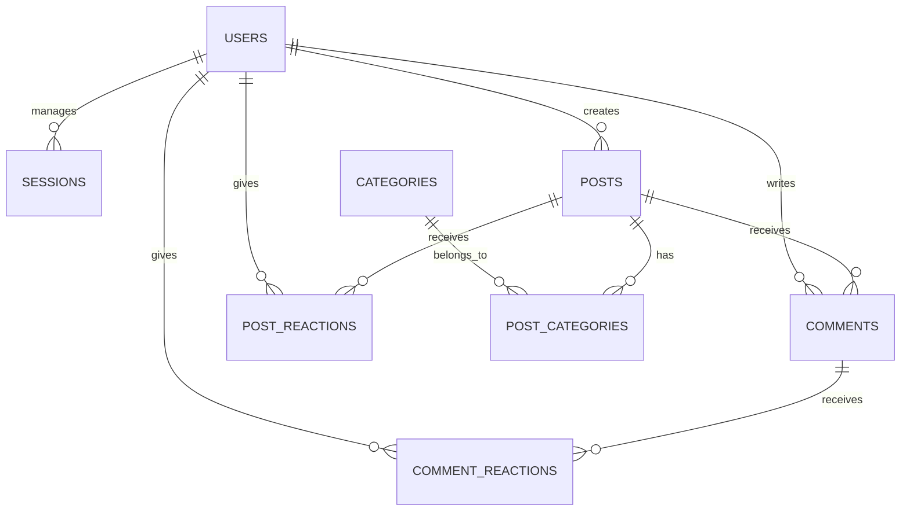
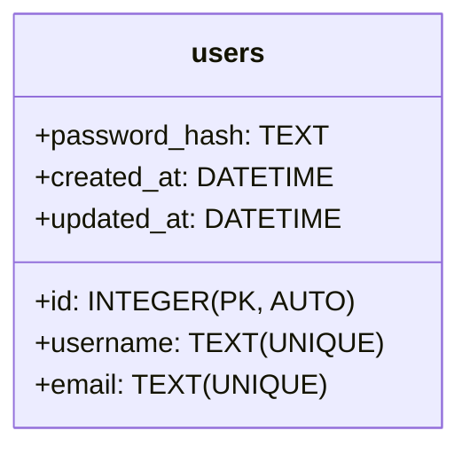
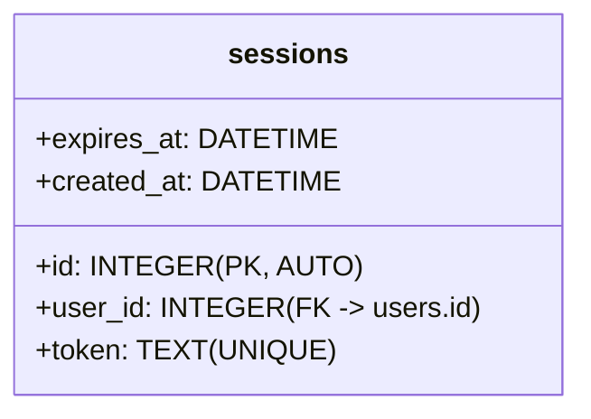
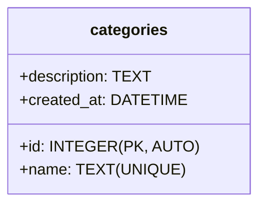
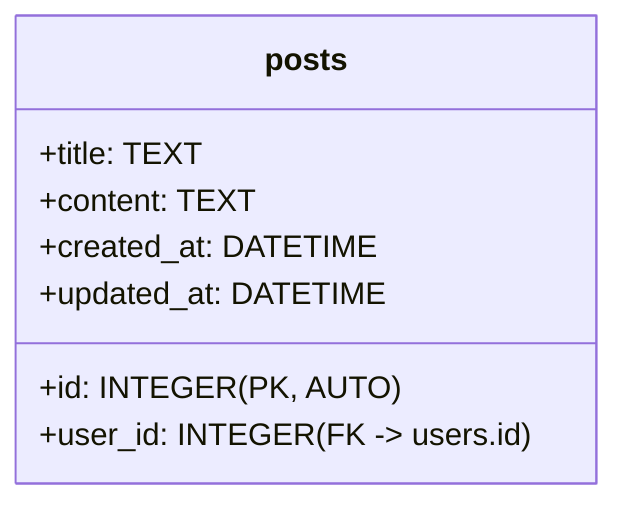
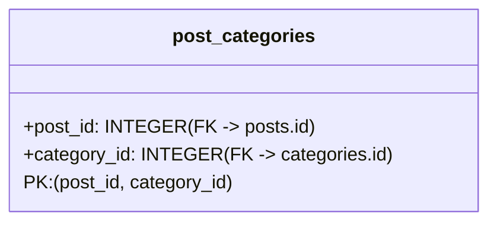
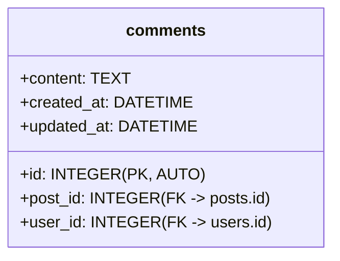
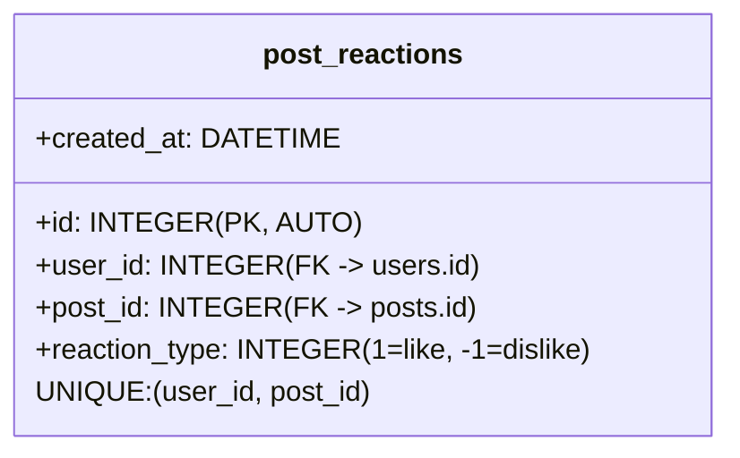
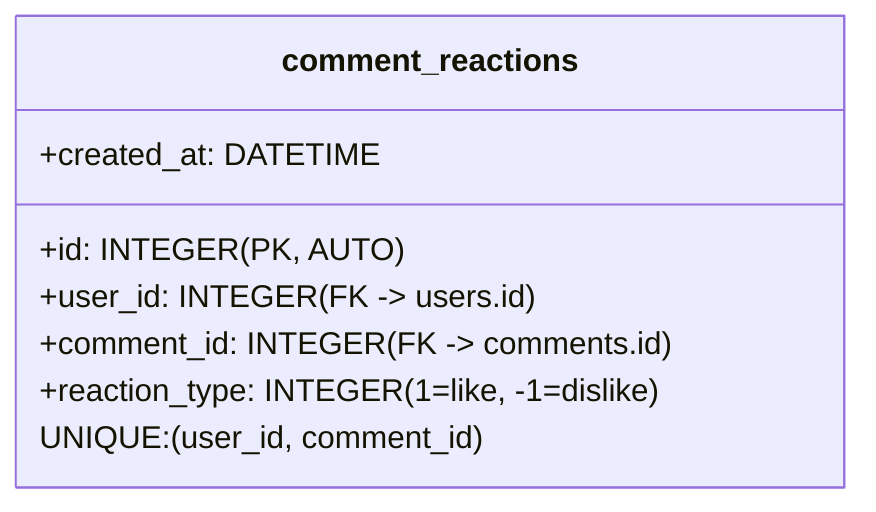

# Database Structure

This document provides an overview of the SQLite database schema used in the forum application.

## Tables Overview

- **users**: Stores registered user information (id, username, email, password_hash, timestamps)
- **sessions**: Manages user login sessions with tokens and expiration times
- **categories**: Defines post categories/tags with names and descriptions
- **posts**: Contains forum posts with title, content, and author references
- **post_categories**: Junction table linking posts to multiple categories (many-to-many)
- **comments**: Stores comments on posts with content and author references
- **post_reactions**: Tracks likes (+1) and dislikes (-1) for posts
- **comment_reactions**: Tracks likes (+1) and dislikes (-1) for comments

## Key columns by table

- users: id (PK), username (unique), email (unique), password_hash, created_at, updated_at
- sessions: id (PK), user_id (FK -> users.id), token (unique), expires_at, created_at
- categories: id (PK), name (unique), description, created_at
- posts: id (PK), user_id (FK -> users.id), title, content, created_at, updated_at
- post_categories: post_id (FK -> posts.id), category_id (FK -> categories.id) — composite PK (post_id, category_id)
- comments: id (PK), post_id (FK -> posts.id), user_id (FK -> users.id), content, created_at, updated_at
- post_reactions: id (PK), user_id (FK -> users.id), post_id (FK -> posts.id), reaction_type (1|-1), created_at — UNIQUE (user_id, post_id)
- comment_reactions: id (PK), user_id (FK -> users.id), comment_id (FK -> comments.id), reaction_type (1|-1), created_at — UNIQUE (user_id, comment_id)

## Entity-Relationship Diagram

## Table Schemas

### Users Table

### Sessions Table

### Categories Table

### Posts Table

### Post_Categories Table

### Comments Table

### Post Reactions Table

### Comment Reactions Table
