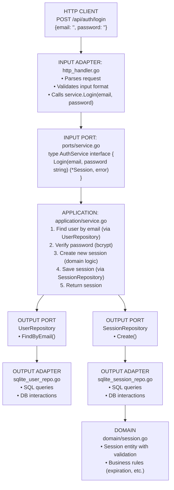
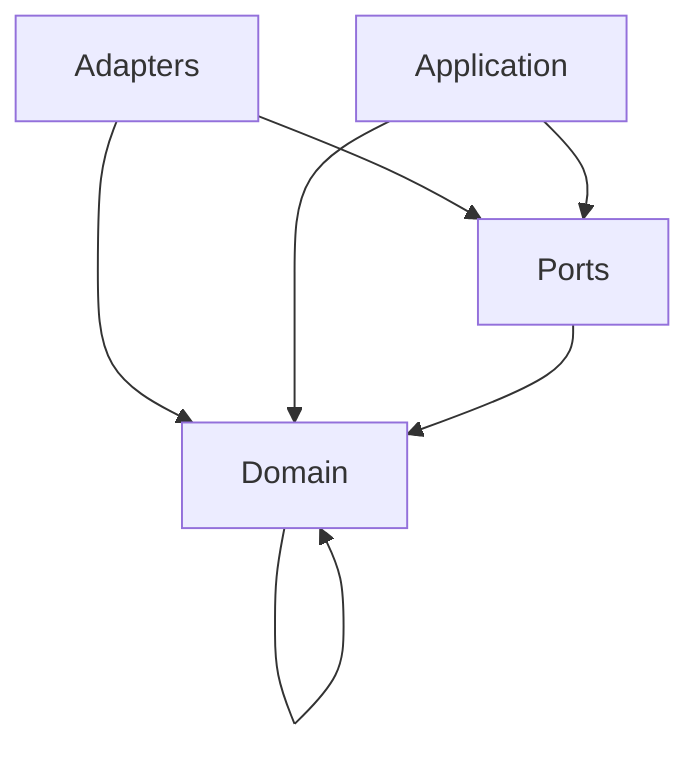

# Auth Module - Information Flow

## Overview
The **auth** module handles user authentication and session management using hexagonal architecture.

## Module Structure
```
auth/
├── domain/          # Pure business logic (no dependencies)
├── ports/           # Interface contracts
├── application/     # Business orchestration
└── adapters/        # Technical implementations
```

## Information Flow

### Request Flow (User Login Example)
```
1. HTTP Request
   ↓
2. INPUT ADAPTER (http_handler.go)
   - Receives HTTP POST /api/auth/login
   - Parses JSON request body
   ↓
3. INPUT PORT (ports/service.go)
   - AuthService interface defines Login(email, password)
   ↓
4. APPLICATION (application/service.go)
   - Implements AuthService interface
   - Orchestrates business logic
   ↓
5. OUTPUT PORT (ports/repository.go)
   - UserRepository.FindByEmail(email)
   - SessionRepository.Create(session)
   ↓
6. OUTPUT ADAPTER (sqlite_*_repository.go)
   - Executes SQL queries
   - Returns domain entities
   ↓
7. DOMAIN (domain/session.go)
   - Session entity with validation
   - Business rules (expiration, etc.)
   ↓
8. Response flows back up the chain
   ↓
9. HTTP Response with session cookie
```

## Detailed Architecture Diagram



## Dependency Flow



**Key Rule**: Dependencies point INWARD. Domain has zero external dependencies.

## Key Components

### Domain Layer
- **Session** entity: UUID token, user ID, expiration time
- **Validation**: Token format, expiration checks
- **Errors**: Domain-specific errors (ErrSessionExpired, ErrInvalidCredentials)

### Ports Layer
- **AuthService** (INPUT): Login, Register, Logout, ValidateSession
- **UserRepository** (OUTPUT): FindByEmail, FindByID, Create
- **SessionRepository** (OUTPUT): Create, FindByToken, Delete, DeleteExpired

### Application Layer
- **service.go**: Implements AuthService interface
- Orchestrates: password hashing, session creation, validation
- Uses: UserRepository, SessionRepository interfaces

### Adapters Layer
- **http_handler.go** (INPUT): HTTP endpoints → Service calls
- **sqlite_user_repository.go** (OUTPUT): SQL queries for users
- **sqlite_session_repository.go** (OUTPUT): SQL queries for sessions

## Data Flow Example: Session Validation

```
Cookie: session_token=abc-123
         ↓
http_handler.ValidateSession()
         ↓
authService.ValidateSession(token)
         ↓
sessionRepo.FindByToken(token)
         ↓
[SQL: SELECT * FROM sessions WHERE token = ?]
         ↓
domain.Session{} (with expiration check)
         ↓
Is expired? → Return error
Not expired? → Return user_id
         ↓
http_handler sets user in context
         ↓
Next middleware/handler
```

## Why This Architecture?

1. **Testability**: Mock ports/interfaces for testing
2. **Flexibility**: Swap SQLite → Postgres by changing only adapters
3. **Clarity**: Clear boundaries between layers
4. **Independence**: Domain logic has no external dependencies

## Module Dependencies

Auth module imports:
- ✅ `platform/database` - For DB connection
- ✅ `platform/logger` - For logging
- ✅ `golang.org/x/crypto/bcrypt` - For password hashing
- ✅ `github.com/gofrs/uuid` - For session tokens

Auth module does NOT import other modules directly.

---

## Detailed Walk-Through: Login Flow (For Junior Developers)

This section shows the **exact file paths** and **function calls** with detailed explanations.

### Where Are API Routes Registered?

API routes are registered in the main application startup:

**File: `/home/ertval/code/zone-modules/forum/cmd/forum/main.go`**
```go
func main() {
    // 1. Load configuration and logger
    cfg := config.Load()
    lgr := logger.New(cfg.Log)
    
    // 2. Initialize all modules (dependency injection)
    app, err := wire.InitializeApp(cfg, lgr)
    
    // 3. Start HTTP server with all routes registered
    app.Start()
}
```

**File: `/home/ertval/code/zone-modules/forum/cmd/forum/wire/app.go`**
```go
func InitializeApp(cfg *config.Config, lgr *logger.Logger) (*App, error) {
    // Initialize database
    db := database.NewConnection(cfg.DB)
    
    // Initialize repositories (repos.go)
    userRepo := initUserRepository(db)
    sessionRepo := initSessionRepository(db)
    
    // Initialize services (services.go)
    authService := initAuthService(userRepo, sessionRepo, lgr)
    
    // Initialize handlers (handlers.go)
    authHandler := initAuthHandler(authService, lgr)
    
    // Register routes
    mux := http.NewServeMux()
    authHandler.RegisterRoutes(mux)  // ← Routes registered here!
    
    return &App{Server: httpserver.New(mux, cfg.Server)}, nil
}
```

**File: `/home/ertval/code/zone-modules/forum/internal/modules/auth/adapters/http_handler.go`**
```go
type Handler struct {
    service ports.AuthService  // Uses interface, not concrete implementation
    logger  *logger.Logger
}

// RegisterRoutes registers all auth endpoints
func (h *Handler) RegisterRoutes(mux *http.ServeMux) {
    mux.HandleFunc("POST /api/auth/login", h.Login)      // ← Route defined here!
    mux.HandleFunc("POST /api/auth/register", h.Register)
    mux.HandleFunc("POST /api/auth/logout", h.Logout)
    mux.HandleFunc("GET /api/auth/session", h.GetSession)
}
```

### Complete Login Flow: Function-by-Function

#### Step 1: HTTP Request Arrives

```
User submits: POST /api/auth/login
Body: {"email": "user@example.com", "password": "secret123"}
```

**File: `internal/modules/auth/adapters/http_handler.go`**

Function: `Login(w http.ResponseWriter, r *http.Request)`

```go
func (h *Handler) Login(w http.ResponseWriter, r *http.Request) {
    // 1. Parse JSON request body
    var req LoginRequest
    if err := json.NewDecoder(r.Body).Decode(&req); err != nil {
        http.Error(w, "Invalid JSON", http.StatusBadRequest)
        return
    }
    
    // 2. Validate input
    if req.Email == "" || req.Password == "" {
        http.Error(w, "Email and password required", http.StatusBadRequest)
        return
    }
    
    // 3. Call service layer (INPUT PORT)
    session, err := h.service.Login(r.Context(), req.Email, req.Password)
    if err != nil {
        // Handle domain errors (ErrInvalidCredentials, etc.)
        h.handleError(w, err)
        return
    }
    
    // 4. Set session cookie
    http.SetCookie(w, &http.Cookie{
        Name:     "session_token",
        Value:    session.Token,
        HttpOnly: true,
        Secure:   true,
        SameSite: http.SameSiteStrictMode,
        Expires:  session.ExpiresAt,
    })
    
    // 5. Return success response
    w.WriteHeader(http.StatusOK)
    json.NewEncoder(w).Encode(map[string]interface{}{
        "user_id": session.UserID,
        "expires_at": session.ExpiresAt,
    })
}
```

#### Step 2: Service Layer Orchestrates Business Logic

**File: `internal/modules/auth/application/service.go`**

Function: `Login(ctx context.Context, email, password string) (*domain.Session, error)`

```go
type service struct {
    userRepo    ports.UserRepository     // OUTPUT PORT (interface)
    sessionRepo ports.SessionRepository  // OUTPUT PORT (interface)
    logger      *logger.Logger
}

func (s *service) Login(ctx context.Context, email, password string) (*domain.Session, error) {
    // 1. Find user by email (calls repository)
    user, err := s.userRepo.FindByEmail(ctx, email)
    if err != nil {
        if errors.Is(err, domain.ErrUserNotFound) {
            return nil, domain.ErrInvalidCredentials
        }
        return nil, fmt.Errorf("failed to find user: %w", err)
    }
    
    // 2. Verify password (bcrypt comparison)
    if err := bcrypt.CompareHashAndPassword(
        []byte(user.PasswordHash), 
        []byte(password),
    ); err != nil {
        s.logger.Info("Invalid password attempt", 
            logger.String("email", email))
        return nil, domain.ErrInvalidCredentials
    }
    
    // 3. Create session entity (domain logic)
    session := domain.NewSession(user.ID, 24*time.Hour)
    
    // 4. Save session to database (calls repository)
    if err := s.sessionRepo.Create(ctx, session); err != nil {
        return nil, fmt.Errorf("failed to create session: %w", err)
    }
    
    s.logger.Info("User logged in", 
        logger.Int64("user_id", user.ID))
    
    return session, nil
}
```

#### Step 3: Domain Logic Creates Session

**File: `internal/modules/auth/domain/session.go`**

Function: `NewSession(userID int64, duration time.Duration) *Session`

```go
type Session struct {
    ID        int64
    Token     string     // UUID token
    UserID    int64
    CreatedAt time.Time
    ExpiresAt time.Time
}

func NewSession(userID int64, duration time.Duration) *Session {
    now := time.Now()
    
    // Generate unique token (UUID v4)
    token := uuid.Must(uuid.NewV4()).String()
    
    return &Session{
        Token:     token,
        UserID:    userID,
        CreatedAt: now,
        ExpiresAt: now.Add(duration),
    }
}

// IsExpired checks if session has expired (business rule)
func (s *Session) IsExpired() bool {
    return time.Now().After(s.ExpiresAt)
}
```

#### Step 4: Repository Saves to Database

**File: `internal/modules/auth/adapters/sqlite_user_repository.go`**

Function: `FindByEmail(ctx context.Context, email string) (*domain.User, error)`

```go
type sqliteUserRepository struct {
    db *sql.DB
}

func (r *sqliteUserRepository) FindByEmail(ctx context.Context, email string) (*domain.User, error) {
    query := `
        SELECT id, username, email, password_hash, created_at, updated_at
        FROM users
        WHERE email = ?
    `
    
    var user domain.User
    err := r.db.QueryRowContext(ctx, query, email).Scan(
        &user.ID,
        &user.Username,
        &user.Email,
        &user.PasswordHash,
        &user.CreatedAt,
        &user.UpdatedAt,
    )
    
    if err != nil {
        if err == sql.ErrNoRows {
            return nil, domain.ErrUserNotFound  // Domain error
        }
        return nil, err
    }
    
    return &user, nil
}
```

**File: `internal/modules/auth/adapters/sqlite_session_repository.go`**

Function: `Create(ctx context.Context, session *domain.Session) error`

```go
type sqliteSessionRepository struct {
    db *sql.DB
}

func (r *sqliteSessionRepository) Create(ctx context.Context, session *domain.Session) error {
    query := `
        INSERT INTO sessions (token, user_id, created_at, expires_at)
        VALUES (?, ?, ?, ?)
    `
    
    result, err := r.db.ExecContext(ctx, query,
        session.Token,
        session.UserID,
        session.CreatedAt,
        session.ExpiresAt,
    )
    
    if err != nil {
        return fmt.Errorf("failed to insert session: %w", err)
    }
    
    // Get generated ID
    id, err := result.LastInsertId()
    if err != nil {
        return err
    }
    
    session.ID = id
    return nil
}
```

### Summary of Function Calls (Login Flow)

```
1. main.go → wire.InitializeApp()
   ↓
2. wire/app.go → authHandler.RegisterRoutes(mux)
   ↓
3. auth/adapters/http_handler.go → RegisterRoutes()
   ↓ (When POST /api/auth/login arrives)
   ↓
4. auth/adapters/http_handler.go → Login(w, r)
   ↓ Parse request, validate
   ↓
5. auth/application/service.go → Login(ctx, email, password)
   ↓
6. auth/adapters/sqlite_user_repository.go → FindByEmail(ctx, email)
   ↓ SQL: SELECT * FROM users WHERE email = ?
   ↓
7. Go stdlib: bcrypt.CompareHashAndPassword()
   ↓
8. auth/domain/session.go → NewSession(userID, duration)
   ↓ Generate UUID token, set expiration
   ↓
9. auth/adapters/sqlite_session_repository.go → Create(ctx, session)
   ↓ SQL: INSERT INTO sessions (...)
   ↓
10. Back to service → return session
    ↓
11. Back to handler → set cookie, return JSON
```

### File Structure Summary

```
cmd/forum/
├── main.go                          ← Entry point
└── wire/
    ├── app.go                       ← Dependency injection orchestration
    ├── repos.go                     ← Repository initialization
    ├── services.go                  ← Service initialization
    └── handlers.go                  ← Handler initialization & route registration

internal/modules/auth/
├── domain/
│   ├── session.go                   ← Session entity (NewSession, IsExpired)
│   ├── errors.go                    ← Domain errors (ErrInvalidCredentials)
├── ports/
│   ├── service.go                   ← AuthService interface (Login method)
│   └── repository.go                ← UserRepository, SessionRepository interfaces
├── application/
│   └── service.go                   ← AuthService implementation (Login logic)
└── adapters/
    ├── http_handler.go              ← HTTP handler (Login endpoint)
    ├── sqlite_user_repository.go    ← User database queries
    └── sqlite_session_repository.go ← Session database queries
```

### Key Takeaways for Junior Developers

1. **Routes are registered in `http_handler.go`** using `RegisterRoutes(mux)`
2. **Handler calls Service** via interface (`ports.AuthService`)
3. **Service orchestrates** business logic and calls repositories
4. **Repositories** execute SQL and return domain entities
5. **Domain entities** contain business rules (validation, expiration checks)
6. **Dependencies flow inward**: Handler → Service (via port) → Repository (via port) → Domain
7. **Testing is easy**: Mock the interfaces (`ports.AuthService`, `ports.UserRepository`) to test each layer independently
