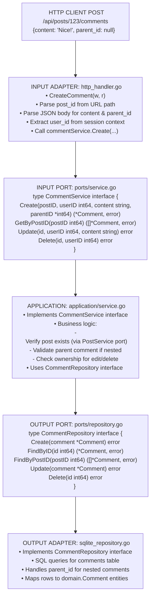
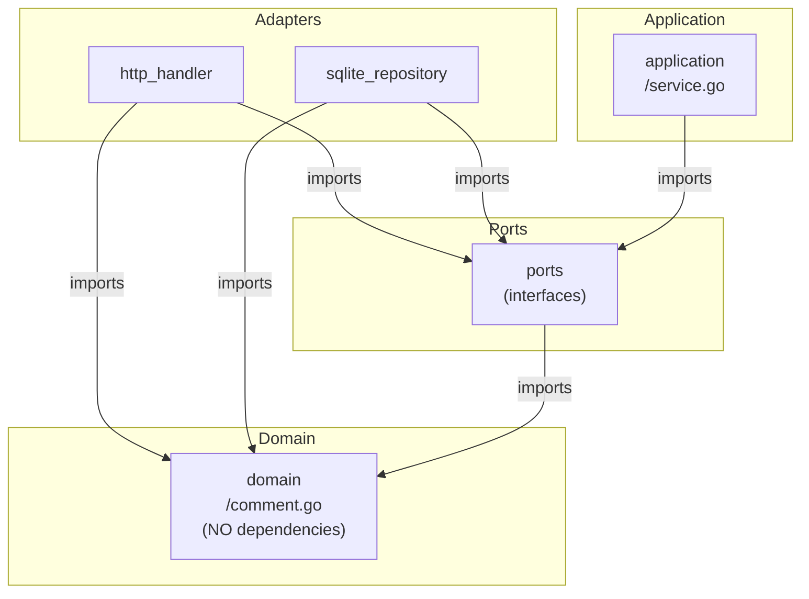
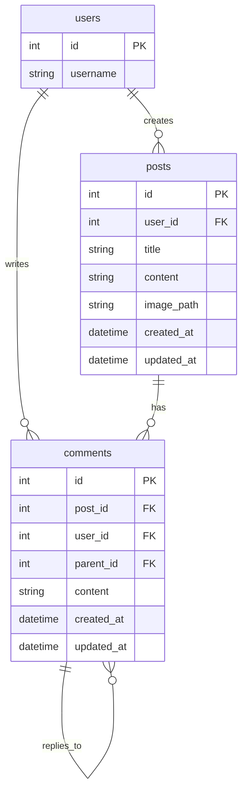

# Comment Module - Information Flow

## Overview

The **comment** module manages comments on posts, supporting nested threads and CRUD operations using hexagonal architecture.

## Module Structure

```text
comment/
├── domain/          # Comment entity and business rules
├── ports/           # Service and repository interfaces
├── application/     # Business orchestration
└── adapters/        # HTTP handlers and SQLite repository
```

## Information Flow

### Request Flow (Add Comment Example)

```text
1. HTTP Request: POST /api/posts/123/comments
   Body: {content: "Great post!", parent_id: null}
   ↓
2. INPUT ADAPTER (http_handler.go)
   - Parse JSON body
   - Extract post ID from URL
   - Extract user ID from session
   - Call service.Create(commentData)
   ↓
3. INPUT PORT (ports/service.go)
   - CommentService.Create(postID, userID, content, parentID)
   ↓
4. APPLICATION (application/service.go)
   - Validate post exists (via PostService)
   - Validate parent comment if replying
   - Create comment entity
   ↓
5. OUTPUT PORT (ports/repository.go)
   - CommentRepository.Create(comment)
   ↓
6. OUTPUT ADAPTER (sqlite_repository.go)
   - INSERT INTO comments (post_id, user_id, content, parent_id, ...)
   ↓
7. DOMAIN (domain/comment.go)
   - Comment entity with validation
   ↓
8. Response flows back
   ↓
9. HTTP Response: 201 Created with comment data
```

## Detailed Architecture Diagram



## Dependency Flow

Direction: Everything depends on DOMAIN (center of hexagon)



## Key Components

### Domain Layer (domain/)

**comment.go**:

- Comment entity: ID, PostID, UserID, ParentID (nullable), Content, CreatedAt, UpdatedAt
- Validation: Content not empty, max length
- Business rule: Nested comments (parent_id references another comment)

**errors.go**:

- `ErrCommentNotFound`, `ErrUnauthorized`, `ErrInvalidParent`

### Ports Layer (ports/)

**service.go** (INPUT PORT):

- Defines comment operations
- Methods: Create, GetByPostID, GetByUserID, Update, Delete

**repository.go** (OUTPUT PORT):

- Data access contract
- Methods: Create, FindByID, FindByPostID, FindByUserID, Update, Delete

### Application Layer (application/)

**service.go**:

- Implements CommentService
- Business logic:
  - Post must exist before commenting (check via PostService)
  - Parent comment must exist and belong to same post (for nested replies)
  - User can only edit/delete own comments
  - Moderators can delete any comment

### Adapters Layer (adapters/)

**http_handler.go** (INPUT ADAPTER):

- Endpoints: POST /posts/:id/comments, GET /posts/:id/comments, PUT /comments/:id, DELETE /comments/:id
- JSON request/response handling

**sqlite_repository.go** (OUTPUT ADAPTER):

- SQL for `comments` table
- Self-referencing foreign key (parent_id → comments.id)
- Ordering by created_at for chronological display

## Data Flow Examples

### Example 1: Create Top-Level Comment

```text
POST /api/posts/123/comments
{content: "Great post!"}
(User 456 is logged in)

         ↓

http_handler.CreateComment()
  • postID = 123 (from URL)
  • userID = 456 (from session)
  • content = "Great post!"
  • parentID = null
         ↓

commentService.Create(123, 456, "Great post!", nil)
  • Check post exists: postService.GetByID(123)
  • Create domain.Comment entity
  • Validate content (not empty, max length)
         ↓

commentRepo.Create(&Comment{
  PostID: 123,
  UserID: 456,
  Content: "Great post!",
  ParentID: nil,
  CreatedAt: now(),
})
  • SQL: INSERT INTO comments (post_id, user_id, content, parent_id, created_at, updated_at)
         VALUES (123, 456, 'Great post!', NULL, ?, ?)
  • Return generated ID
         ↓

201 Created
{id: 789, post_id: 123, user_id: 456, content: "Great post!", parent_id: null}
```

### Example 2: Create Nested Comment (Reply)

```text
POST /api/posts/123/comments
{content: "I agree!", parent_id: 789}
(User 999 is logged in)

         ↓

http_handler.CreateComment()
  • postID = 123
  • userID = 999
  • content = "I agree!"
  • parentID = 789
         ↓

commentService.Create(123, 999, "I agree!", &789)
  • Check post 123 exists
  • Check parent comment 789 exists: commentRepo.FindByID(789)
  • Verify parent belongs to same post (parent.PostID == 123)
  • Create domain.Comment entity
         ↓

commentRepo.Create(&Comment{
  PostID: 123,
  UserID: 999,
  Content: "I agree!",
  ParentID: &789,
  CreatedAt: now(),
})
  • SQL: INSERT INTO comments (...) VALUES (..., 789, ...)
         ↓

201 Created
{id: 888, post_id: 123, user_id: 999, content: "I agree!", parent_id: 789}
```

### Example 3: List Comments for Post (Nested Structure)

```text
GET /api/posts/123/comments

         ↓

http_handler.ListComments()
  • postID = 123
         ↓

commentService.GetByPostID(123)
         ↓

commentRepo.FindByPostID(123)
  • SQL: SELECT * FROM comments WHERE post_id = 123 ORDER BY created_at ASC
         ↓

[]*domain.Comment (flat list)
         ↓

Application layer builds nested structure:
{
  id: 789,
  content: "Great post!",
  parent_id: null,
  replies: [
    {
      id: 888,
      content: "I agree!",
      parent_id: 789,
      replies: []
    }
  ]
}
         ↓

200 OK with nested comment tree
```

### Example 4: Delete Comment (Authorization)

```text
DELETE /api/comments/789
(User 456 is logged in)

         ↓

http_handler.DeleteComment()
  • commentID = 789
  • userID = 456 (from session)
         ↓

commentService.Delete(789, 456)
  • Fetch comment: commentRepo.FindByID(789)
  • Check ownership: comment.UserID == 456?
    - YES: Proceed
    - NO: Check if moderator, else return ErrUnauthorized
         ↓

commentRepo.Delete(789)
  • SQL: DELETE FROM comments WHERE id = 789
  • Note: May cascade delete child comments (depends on schema)
         ↓

204 No Content
```

## Comment Threading

### Nested Comment Structure

```text
Post 123
├─ Comment 789 (parent_id: null) "Great post!"
│  ├─ Comment 888 (parent_id: 789) "I agree!"
│  └─ Comment 777 (parent_id: 789) "Me too!"
├─ Comment 666 (parent_id: null) "Disagree"
   └─ Comment 555 (parent_id: 666) "Why?"
```

**Repository Returns**: Flat list ordered by created_at
**Application/Handler**: Builds nested tree structure using parent_id references

## Cross-Module Communication

Comment module interacts with other modules:

```text
commentService.Create(...)
    ↓
postService.GetByID(postID)  ← Verify post exists
    ↓
userService.GetByID(userID)  ← Get user info for response
    ↓
notificationService.NotifyPostAuthor(...)  ← Optional notification
```

**Pattern**: Always via service interfaces (INPUT PORTS).

## Database Schema Relationships



## Why This Architecture?

1. **Nested Comments**: Domain logic handles threading without coupling to storage
2. **Authorization**: Business rules (ownership) in application layer, testable without HTTP
3. **Post Validation**: Cross-module check via PostService interface, no direct dependency
4. **Flexible Display**: Repository returns flat list, presentation layer builds tree

## Module Dependencies

Comment module imports:

- ✅ `platform/database` - Database connection
- ✅ `platform/logger` - Logging
- ✅ `internal/modules/post/ports` - PostService interface (to verify post exists)
- ✅ `internal/modules/user/ports` - UserService interface (optional, for user info)

Comment module does NOT import:

- ❌ Post/User adapters or applications (only ports)

---

## Detailed Walk-Through: Create Comment Flow (For Junior Developers)

This section shows **exact file paths**, **function calls**, and **cross-module communication** in detail.

### Where Are API Routes Registered?

**File: `/home/ertval/code/zone-modules/forum/cmd/forum/main.go`**
```go
func main() {
    cfg := config.Load()
    lgr := logger.New(cfg.Log)
    
    // All modules initialized here
    app, err := wire.InitializeApp(cfg, lgr)
    
    app.Start()  // Starts server with all routes
}
```

**File: `/home/ertval/code/zone-modules/forum/cmd/forum/wire/handlers.go`**
```go
func initHandlers(
    authService ports.AuthService,
    postService ports.PostService,
    commentService ports.CommentService,  // ← Comment service
    // ... other services
) *http.ServeMux {
    mux := http.NewServeMux()
    
    // Initialize handlers
    authHandler := auth.NewHandler(authService)
    postHandler := post.NewHandler(postService)
    commentHandler := comment.NewHandler(commentService)  // ← Comment handler
    
    // Register all routes
    authHandler.RegisterRoutes(mux)
    postHandler.RegisterRoutes(mux)
    commentHandler.RegisterRoutes(mux)  // ← Routes registered here
    
    return mux
}
```

**File: `/home/ertval/code/zone-modules/forum/internal/modules/comment/adapters/http_handler.go`**
```go
type Handler struct {
    service ports.CommentService  // Interface, not concrete type
    logger  *logger.Logger
}

// RegisterRoutes registers all comment endpoints
func (h *Handler) RegisterRoutes(mux *http.ServeMux) {
    // POST /api/posts/123/comments
    mux.HandleFunc("POST /api/posts/{postID}/comments", h.CreateComment)
    
    // GET /api/posts/123/comments
    mux.HandleFunc("GET /api/posts/{postID}/comments", h.ListComments)
    
    // PUT /api/comments/456
    mux.HandleFunc("PUT /api/comments/{id}", h.UpdateComment)
    
    // DELETE /api/comments/456
    mux.HandleFunc("DELETE /api/comments/{id}", h.DeleteComment)
}
```

### Complete Flow: User Comments on a Post (With Cross-Module Communication)

**Scenario**: User 999 comments on Post 123. We need to:
1. Verify the post exists (cross-module call to Post module)
2. Create the comment
3. Notify the post author (cross-module call to Notification module)

#### Step 1: HTTP Request Arrives

```
POST /api/posts/123/comments
Headers: Cookie: session_token=abc-xyz
Body: {"content": "Great post!", "parent_id": null}
```

**File: `internal/modules/comment/adapters/http_handler.go`**

Function: `CreateComment(w http.ResponseWriter, r *http.Request)`

```go
func (h *Handler) CreateComment(w http.ResponseWriter, r *http.Request) {
    // 1. Extract post ID from URL path
    postID, err := strconv.ParseInt(r.PathValue("postID"), 10, 64)
    if err != nil {
        http.Error(w, "Invalid post ID", http.StatusBadRequest)
        return
    }
    
    // 2. Get user ID from session (set by auth middleware)
    userID := r.Context().Value("user_id").(int64)
    
    // 3. Parse JSON request body
    var req CreateCommentRequest
    if err := json.NewDecoder(r.Body).Decode(&req); err != nil {
        http.Error(w, "Invalid JSON", http.StatusBadRequest)
        return
    }
    
    // 4. Call service layer
    comment, err := h.service.Create(r.Context(), postID, userID, req.Content, req.ParentID)
    if err != nil {
        h.handleError(w, err)
        return
    }
    
    // 5. Return success response
    w.WriteHeader(http.StatusCreated)
    json.NewEncoder(w).Encode(comment)
}
```

#### Step 2: Service Layer - Orchestrate Business Logic & Cross-Module Calls

**File: `internal/modules/comment/application/service.go`**

Function: `Create(ctx context.Context, postID, userID int64, content string, parentID *int64) (*domain.Comment, error)`

```go
type service struct {
    commentRepo  ports.CommentRepository  // OUTPUT PORT (our module)
    postService  postports.PostService    // INPUT PORT (post module)
    notifService notifports.NotificationService  // INPUT PORT (notification module)
    logger       *logger.Logger
}

func (s *service) Create(
    ctx context.Context,
    postID, userID int64,
    content string,
    parentID *int64,
) (*domain.Comment, error) {
    
    // === CROSS-MODULE CALL #1: Verify Post Exists ===
    // Call post module to check if post exists
    post, err := s.postService.GetByID(ctx, postID)
    if err != nil {
        if errors.Is(err, postdomain.ErrPostNotFound) {
            return nil, domain.ErrInvalidPost
        }
        return nil, fmt.Errorf("failed to get post: %w", err)
    }
    
    s.logger.Info("Post found", logger.Int64("post_id", postID))
    
    // === Validate Parent Comment (if replying) ===
    if parentID != nil {
        parent, err := s.commentRepo.FindByID(ctx, *parentID)
        if err != nil {
            return nil, domain.ErrInvalidParent
        }
        
        // Parent must belong to same post
        if parent.PostID != postID {
            return nil, domain.ErrInvalidParent
        }
    }
    
    // === Create Comment Entity (Domain Logic) ===
    comment := &domain.Comment{
        PostID:    postID,
        UserID:    userID,
        ParentID:  parentID,
        Content:   content,
        CreatedAt: time.Now(),
        UpdatedAt: time.Now(),
    }
    
    // Validate content (domain business rule)
    if err := comment.Validate(); err != nil {
        return nil, err
    }
    
    // === Save to Database ===
    if err := s.commentRepo.Create(ctx, comment); err != nil {
        return nil, fmt.Errorf("failed to create comment: %w", err)
    }
    
    s.logger.Info("Comment created",
        logger.Int64("comment_id", comment.ID),
        logger.Int64("post_id", postID),
        logger.Int64("user_id", userID))
    
    // === CROSS-MODULE CALL #2: Notify Post Author ===
    // Notify the post author that someone commented
    // (Only if commenter is not the post author)
    if userID != post.UserID {
        err := s.notifService.NotifyComment(ctx, post.UserID, userID, postID)
        if err != nil {
            // Log error but don't fail the comment creation
            s.logger.Error("Failed to send notification",
                logger.Error(err),
                logger.Int64("recipient_id", post.UserID))
        }
    }
    
    return comment, nil
}
```

**Key Points**:
- We call `postService.GetByID()` - this is the **Post module's INPUT PORT**
- We call `notifService.NotifyComment()` - this is the **Notification module's INPUT PORT**
- We only import **interfaces** (ports), never concrete implementations
- If notification fails, we log it but don't fail the comment creation

#### Step 3: Cross-Module Call - Post Module

**File: `internal/modules/post/application/service.go`**

Function: `GetByID(ctx context.Context, id int64) (*domain.Post, error)`

```go
// This is in the POST MODULE, being called by comment module
func (s *service) GetByID(ctx context.Context, id int64) (*domain.Post, error) {
    post, err := s.postRepo.FindByID(ctx, id)
    if err != nil {
        if err == sql.ErrNoRows {
            return nil, domain.ErrPostNotFound
        }
        return nil, err
    }
    
    return post, nil
}
```

**File: `internal/modules/post/adapters/sqlite_repository.go`**

Function: `FindByID(ctx context.Context, id int64) (*domain.Post, error)`

```go
func (r *sqlitePostRepository) FindByID(ctx context.Context, id int64) (*domain.Post, error) {
    query := `
        SELECT id, user_id, title, content, image_path, created_at, updated_at
        FROM posts
        WHERE id = ?
    `
    
    var post domain.Post
    err := r.db.QueryRowContext(ctx, query, id).Scan(
        &post.ID,
        &post.UserID,
        &post.Title,
        &post.Content,
        &post.ImagePath,
        &post.CreatedAt,
        &post.UpdatedAt,
    )
    
    if err != nil {
        return nil, err
    }
    
    return &post, nil
}
```

#### Step 4: Domain Validation

**File: `internal/modules/comment/domain/comment.go`**

Function: `Validate() error`

```go
type Comment struct {
    ID        int64
    PostID    int64
    UserID    int64
    ParentID  *int64   // Nullable for top-level comments
    Content   string
    CreatedAt time.Time
    UpdatedAt time.Time
}

func (c *Comment) Validate() error {
    // Content must not be empty
    if strings.TrimSpace(c.Content) == "" {
        return ErrEmptyContent
    }
    
    // Content max length: 10,000 characters
    if len(c.Content) > 10000 {
        return ErrContentTooLong
    }
    
    // PostID must be positive
    if c.PostID <= 0 {
        return ErrInvalidPost
    }
    
    // UserID must be positive
    if c.UserID <= 0 {
        return ErrInvalidUser
    }
    
    return nil
}
```

#### Step 5: Repository Saves to Database

**File: `internal/modules/comment/adapters/sqlite_repository.go`**

Function: `Create(ctx context.Context, comment *domain.Comment) error`

```go
type sqliteCommentRepository struct {
    db *sql.DB
}

func (r *sqliteCommentRepository) Create(ctx context.Context, comment *domain.Comment) error {
    query := `
        INSERT INTO comments (post_id, user_id, parent_id, content, created_at, updated_at)
        VALUES (?, ?, ?, ?, ?, ?)
    `
    
    result, err := r.db.ExecContext(ctx, query,
        comment.PostID,
        comment.UserID,
        comment.ParentID,  // Can be NULL
        comment.Content,
        comment.CreatedAt,
        comment.UpdatedAt,
    )
    
    if err != nil {
        return fmt.Errorf("failed to insert comment: %w", err)
    }
    
    // Get generated ID
    id, err := result.LastInsertId()
    if err != nil {
        return err
    }
    
    comment.ID = id
    return nil
}
```

#### Step 6: Cross-Module Call - Notification Module

**File: `internal/modules/notification/application/service.go`**

Function: `NotifyComment(ctx context.Context, recipientID, actorID, postID int64) error`

```go
// This is in the NOTIFICATION MODULE, being called by comment module
func (s *service) NotifyComment(
    ctx context.Context,
    recipientID, actorID, postID int64,
) error {
    // Don't notify if user comments on their own post
    if recipientID == actorID {
        return nil
    }
    
    // Get actor username for message
    actor, err := s.userService.GetByID(ctx, actorID)
    if err != nil {
        return err
    }
    
    // Create notification
    notification := &domain.Notification{
        RecipientID: recipientID,
        ActorID:     actorID,
        Type:        "comment",
        TargetType:  "post",
        TargetID:    postID,
        Message:     fmt.Sprintf("%s commented on your post", actor.Username),
        IsRead:      false,
        CreatedAt:   time.Now(),
    }
    
    // Save to database
    return s.notificationRepo.Create(ctx, notification)
}
```

### Summary of Function Calls (Create Comment with Cross-Module Communication)

```
1. HTTP Request: POST /api/posts/123/comments
   ↓
2. comment/adapters/http_handler.go → CreateComment(w, r)
   • Parse postID from URL
   • Get userID from session
   • Parse JSON body
   ↓
3. comment/application/service.go → Create(ctx, postID, userID, content, parentID)
   ↓
   ├─→ CROSS-MODULE CALL #1
   │   post/application/service.go → GetByID(ctx, postID)
   │   ↓
   │   post/adapters/sqlite_repository.go → FindByID(ctx, postID)
   │   ↓ SQL: SELECT * FROM posts WHERE id = 123
   │   ↓
   │   Returns post (with user_id = 789)
   │
   ├─→ comment/adapters/sqlite_repository.go → FindByID(ctx, parentID)
   │   (if parent_id provided)
   │
   ├─→ comment/domain/comment.go → Validate()
   │   • Check content not empty
   │   • Check length limit
   │
   ├─→ comment/adapters/sqlite_repository.go → Create(ctx, comment)
   │   ↓ SQL: INSERT INTO comments (post_id, user_id, content, ...)
   │
   └─→ CROSS-MODULE CALL #2
       notification/application/service.go → NotifyComment(ctx, 789, 999, 123)
       ↓
       user/application/service.go → GetByID(ctx, 999)
       ↓ (get commenter's username)
       ↓
       notification/adapters/sqlite_repository.go → Create(ctx, notification)
       ↓ SQL: INSERT INTO notifications (recipient_id, actor_id, ...)
       ↓
       Post author (789) now has notification
   ↓
4. Back to handler → Return 201 Created with comment JSON
```

### How Modules Communicate (Dependency Injection)

**File: `/home/ertval/code/zone-modules/forum/cmd/forum/wire/services.go`**

```go
func initCommentService(
    commentRepo ports.CommentRepository,
    postService postports.PostService,  // ← Injected from post module
    notifService notifports.NotificationService,  // ← Injected from notification module
    logger *logger.Logger,
) ports.CommentService {
    return comment.NewService(commentRepo, postService, notifService, logger)
}
```

**Key Points**:
1. Comment service receives **interfaces** of other services
2. It doesn't know or care about concrete implementations
3. Wire package handles all the wiring
4. Each module stays independent and testable

### File Structure for Cross-Module Communication

```
internal/modules/
├── comment/
│   ├── application/
│   │   └── service.go           ← Imports post/ports & notification/ports
│   ├── adapters/
│   │   ├── http_handler.go      ← Registers routes, handles HTTP
│   │   └── sqlite_repository.go ← Comment database queries
│   └── ports/
│       └── service.go           ← CommentService interface (exported)
│
├── post/
│   ├── application/
│   │   └── service.go           ← Implements GetByID for other modules
│   └── ports/
│       └── service.go           ← PostService interface (exported)
│
└── notification/
    ├── application/
    │   └── service.go           ← Implements NotifyComment for other modules
    └── ports/
        └── service.go           ← NotificationService interface (exported)

cmd/forum/wire/
├── services.go                  ← Wires everything together
└── handlers.go                  ← Registers all routes
```

### Key Takeaways for Junior Developers

1. **Routes Registration**: Done in `http_handler.go` via `RegisterRoutes(mux)` method
2. **Cross-Module Communication**: Always through **interfaces** (ports), never concrete types
3. **Comment → Post**: Comment module calls `postService.GetByID()` to verify post exists
4. **Comment → Notification**: Comment module calls `notifService.NotifyComment()` to notify author
5. **Dependency Injection**: All service dependencies are injected in `wire/services.go`
6. **Error Handling**: Domain errors (like `ErrPostNotFound`) are converted appropriately
7. **No Direct Imports**: Comment never imports `post/application` or `notification/adapters`, only their `ports`
8. **Testability**: You can mock `postService` and `notifService` interfaces to test comment creation independently

This pattern allows modules to work together while staying loosely coupled and independently testable!
