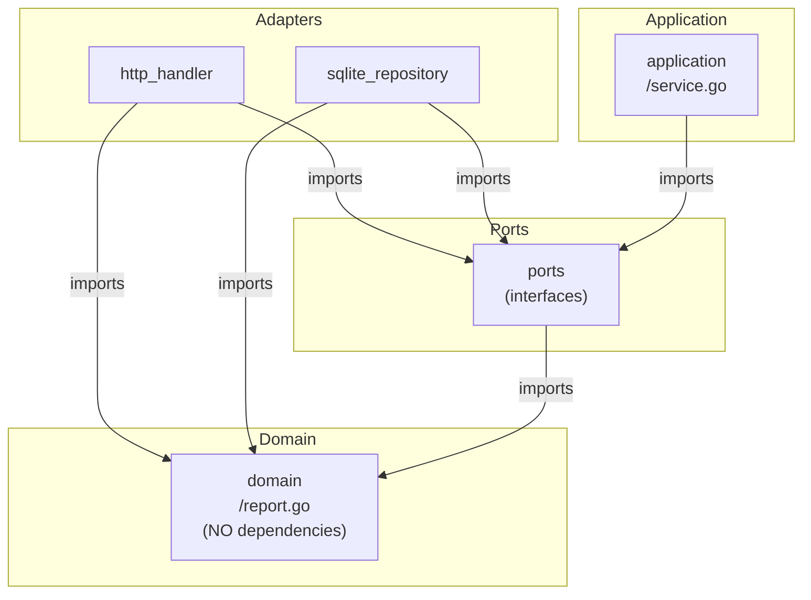
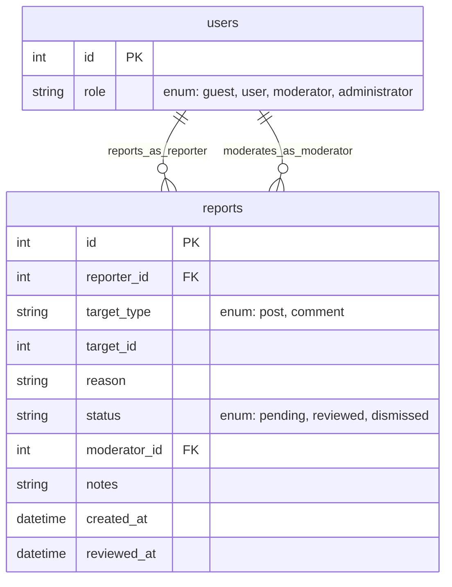

# Moderation Module - Information Flow

## Overview

The **moderation** module (OPTIONAL) handles content reports, user role management, and moderator actions using hexagonal architecture.

## Module Structure

```text
moderation/
├── domain/          # Report entity and business rules
├── ports/           # Service and repository interfaces
├── application/     # Business orchestration
└── adapters/        # HTTP handlers and SQLite repository
```

## Information Flow

### Request Flow (Report Content Example)

```text
1. HTTP Request: POST /api/reports
   Body: {target_type: "post", target_id: 123, reason: "spam"}
   ↓
2. INPUT ADAPTER (http_handler.go)
   - Parse JSON body
   - Extract reporter user ID from session
   - Call service.CreateReport(...)
   ↓
3. INPUT PORT (ports/service.go)
   - ModerationService.CreateReport(reporterID, targetType, targetID, reason)
   ↓
4. APPLICATION (application/service.go)
   - Validate target exists
   - Check if already reported by this user
   - Create report entity
   ↓
5. OUTPUT PORT (ports/repository.go)
   - ReportRepository.Create(report)
   ↓
6. OUTPUT ADAPTER (sqlite_repository.go)
   - INSERT INTO reports (...)
   ↓
7. DOMAIN (domain/report.go)
   - Report entity with status (pending, reviewed, dismissed)
   ↓
8. Response flows back
   ↓
9. HTTP Response: 201 Created with report data
```

## Detailed Architecture Diagram

```mermaid
flowchart TD
    A["HTTP CLIENT<br/>POST /api/reports<br/>{target_type: 'post', target_id: 123, reason: '...'}"] --> B["INPUT ADAPTER: http_handler.go<br/>• CreateReport(w, r) [User role required]<br/>• ReviewReport(w, r) [Moderator role required]<br/>• DeleteContent(w, r) [Moderator role required]<br/>• Parse JSON, extract session user_id<br/>• Call moderationService methods"]
    B --> C["INPUT PORT: ports/service.go<br/>type ModerationService interface {<br/>CreateReport(reporterID, targetType, targetID,<br/>reason string) (*Report, error)<br/>ListReports(filters Filters) ([]*Report, error)<br/>ReviewReport(reportID, moderatorID int64,<br/>action, notes string) error<br/>PromoteUser(userID, targetRole int64) error<br/>DeleteContent(targetType, targetID, modID) error<br/>}"]
    C --> D["APPLICATION: application/service.go<br/>• Implements ModerationService interface<br/>• Business logic:<br/>- Role-based authorization (moderator/admin)<br/>- Prevent duplicate reports from same user<br/>- Track moderation actions<br/>- Cascade delete content with reactions/comments<br/>• Uses ReportRepository interface"]
    D --> E["OUTPUT PORT: ports/repository.go<br/>type ReportRepository interface {<br/>Create(report *Report) error<br/>FindByID(id int64) (*Report, error)<br/>FindAll(filters Filters) ([]*Report, error)<br/>Update(report *Report) error<br/>FindByReporterAndTarget(reporterID, targetType,<br/>targetID) (*Report, error)<br/>}"]
    E --> F["OUTPUT ADAPTER: sqlite_repository.go<br/>• Implements ReportRepository interface<br/>• SQL queries for reports table<br/>• Handles status transitions (pending → reviewed)<br/>• Filters: status, target_type, moderator_id"]
```



## Dependency Flow

Direction: Everything depends on DOMAIN (center of hexagon)



## Key Components

### Domain Layer (domain/)

**report.go**:

- Report entity: ID, ReporterID, TargetType (post/comment), TargetID, Reason, Status, ModeratorID, Notes, CreatedAt, ReviewedAt
- Status enum: Pending, Reviewed, Dismissed
- Validation: Reason not empty, valid status

**errors.go**:

- `ErrReportNotFound`, `ErrUnauthorized`, `ErrDuplicateReport`, `ErrInvalidRole`

### Ports Layer (ports/)

**service.go** (INPUT PORT):

- Defines moderation operations
- Methods: CreateReport, ListReports, ReviewReport, PromoteUser, DemoteUser, DeleteContent

**repository.go** (OUTPUT PORT):

- Data access contract
- Methods: Create, FindByID, FindAll, Update, FindByReporterAndTarget

### Application Layer (application/)

**service.go**:

- Implements ModerationService
- Business logic:
  - **Authorization**: Only moderators/admins can review reports
  - **Duplicate Prevention**: User can't report same content twice
  - **Role Management**: Only admins can promote/demote users
  - **Content Deletion**: Cascade delete reactions, comments when deleting post

### Adapters Layer (adapters/)

**http_handler.go** (INPUT ADAPTER):

- Endpoints:
  - POST /reports (create report)
  - GET /reports (list reports - moderators only)
  - PUT /reports/:id (review report - moderators only)
  - DELETE /posts/:id (delete post - moderators only)
  - PUT /users/:id/role (promote/demote - admins only)
- Middleware: Role-based authorization checks

**sqlite_repository.go** (OUTPUT ADAPTER):

- SQL for `reports` table
- Filter queries by status, target_type, moderator_id
- Join with users table for reporter/moderator info

## Data Flow Examples

### Example 1: User Reports a Post

```text
POST /api/reports
{target_type: "post", target_id: 123, reason: "Spam content"}
(User 456 is logged in)

         ↓

http_handler.CreateReport()
  • Check user role (must be at least "User", not "Guest")
  • reporterID = 456
  • targetType = "post"
  • targetID = 123
  • reason = "Spam content"
         ↓

moderationService.CreateReport(456, "post", 123, "Spam content")
  • Verify target exists: postService.GetByID(123)
  • Check for duplicate: reportRepo.FindByReporterAndTarget(456, "post", 123)
    → Returns nil (no duplicate)
  • Create domain.Report entity
         ↓

reportRepo.Create(&Report{
  ReporterID: 456,
  TargetType: "post",
  TargetID: 123,
  Reason: "Spam content",
  Status: "pending",
  CreatedAt: now(),
})
  • SQL: INSERT INTO reports (reporter_id, target_type, target_id, reason, status, created_at)
         VALUES (456, 'post', 123, 'Spam content', 'pending', ?)
         ↓

201 Created
{id: 789, reporter_id: 456, target_type: "post", target_id: 123, reason: "...", status: "pending"}
```

### Example 2: Moderator Reviews Report

```text
PUT /api/reports/789
{action: "delete_content", notes: "Confirmed spam"}
(User 999 is logged in, role: Moderator)

         ↓

http_handler.ReviewReport()
  • Check user role: Must be Moderator or Admin
  • reportID = 789
  • moderatorID = 999
  • action = "delete_content"
  • notes = "Confirmed spam"
         ↓

moderationService.ReviewReport(789, 999, "delete_content", "Confirmed spam")
  • Fetch report: reportRepo.FindByID(789)
    → Report{TargetType: "post", TargetID: 123, Status: "pending"}
  • Validate moderator role
  • Execute action: Delete content
         ↓

If action == "delete_content":
    moderationService.DeleteContent("post", 123, 999)
        ↓
    postService.Delete(123)  ← Cascade deletes comments, reactions
        ↓

reportRepo.Update(&Report{
  ID: 789,
  Status: "reviewed",
  ModeratorID: 999,
  Notes: "Confirmed spam",
  ReviewedAt: now(),
})
  • SQL: UPDATE reports SET status='reviewed', moderator_id=999, notes='...', reviewed_at=? WHERE id=789
         ↓

200 OK
{id: 789, status: "reviewed", moderator_id: 999, notes: "Confirmed spam"}
```

### Example 3: Admin Promotes User to Moderator

```text
PUT /api/users/456/role
{role: "moderator"}
(User 111 is logged in, role: Administrator)

         ↓

http_handler.UpdateUserRole()
  • Check caller role: Must be Administrator
  • userID = 456
  • targetRole = "moderator"
         ↓

moderationService.PromoteUser(456, "moderator")
  • Validate caller is admin
  • Validate target role is valid (guest/user/moderator/admin)
  • Update user role
         ↓

userService.UpdateRole(456, "moderator")
    ↓
userRepo.Update(&User{ID: 456, Role: "moderator", UpdatedAt: now()})
  • SQL: UPDATE users SET role='moderator', updated_at=? WHERE id=456
         ↓

200 OK
{id: 456, username: "...", role: "moderator"}
```

### Example 4: List Pending Reports (Moderator View)

```text
GET /api/reports?status=pending
(User 999 is logged in, role: Moderator)

         ↓

http_handler.ListReports()
  • Check role: Moderator or Admin
  • Parse filters: status = "pending"
         ↓

moderationService.ListReports(Filters{Status: "pending"})
         ↓

reportRepo.FindAll(Filters{Status: "pending"})
  • SQL: SELECT r.*, u.username as reporter_username
         FROM reports r
         JOIN users u ON r.reporter_id = u.id
         WHERE r.status = 'pending'
         ORDER BY r.created_at DESC
         ↓

[]*Report (with reporter info)
         ↓

200 OK
[
  {id: 789, reporter_id: 456, target_type: "post", target_id: 123, reason: "...", status: "pending"},
  {id: 790, reporter_id: 457, target_type: "comment", target_id: 888, reason: "...", status: "pending"}
]
```

## Role-Based Access Control (RBAC)

### Role Hierarchy

```text
┌─────────────────┐
│  Administrator  │  ← Full access (promote/demote, delete any, review)
└────────┬────────┘
         │
┌────────▼────────┐
│   Moderator     │  ← Review reports, delete content
└────────┬────────┘
         │
┌────────▼────────┐
│      User       │  ← Create posts/comments, create reports
└────────┬────────┘
         │
┌────────▼────────┐
│     Guest       │  ← View only (no posting/reporting)
└─────────────────┘
```

### Permission Checks

```text
CreateReport: Requires "User" role or higher
ReviewReport: Requires "Moderator" role or higher
DeleteContent: Requires "Moderator" role or higher
PromoteUser: Requires "Administrator" role
```

## Cross-Module Communication

Moderation module interacts with many modules:

```text
moderationService.CreateReport(...)
    ↓
If target_type == "post":
    postService.GetByID(targetID)  ← Verify post exists
If target_type == "comment":
    commentService.GetByID(targetID)  ← Verify comment exists
    ↓

moderationService.DeleteContent(...)
    ↓
postService.Delete(postID)  ← Cascade deletes
    ↓
commentService.DeleteByPostID(postID)
    ↓
reactionService.DeleteByTarget("post", postID)
    ↓
notificationService.NotifyAffectedUsers(...)  ← Optional
```

**Pattern**: Always via service interfaces (INPUT PORTS).

## Database Schema Relationships



## Moderation Workflow

```text
1. User reports content
   ↓
2. Report created (status: pending)
   ↓
3. Moderator views pending reports
   ↓
4. Moderator reviews report
   ↓
   ├── Action: Dismiss
   │   ↓
   │   Update status to "dismissed"
   │   Content remains
   │
   └── Action: Delete content
       ↓
       Delete target (post/comment)
       Update report status to "reviewed"
       Cascade delete related content
```

## Why This Architecture?

1. **Role Separation**: RBAC logic in application layer, testable without HTTP
2. **Audit Trail**: Every report and action is logged with moderator ID and notes
3. **Flexible Actions**: Easy to add new moderation actions (warning, ban, etc.)
4. **Cross-Module Safety**: Validates target existence before creating report

## Module Dependencies

Moderation module imports:

- ✅ `platform/database` - Database connection
- ✅ `platform/logger` - Logging
- ✅ `internal/modules/post/ports` - PostService interface
- ✅ `internal/modules/comment/ports` - CommentService interface
- ✅ `internal/modules/user/ports` - UserService interface (role management)

Moderation module does NOT import:

- ❌ Other module adapters or applications (only ports)

---

## Detailed Walk-Through: Moderator Reviews Report & Deletes Content (For Junior Developers)

This shows **role-based authorization** and **cascading deletes** across modules.

### Where Are API Routes Registered?

**File: `internal/modules/moderation/adapters/http_handler.go`**

```go
func (h *Handler) RegisterRoutes(mux *http.ServeMux) {
    // User routes (any authenticated user)
    mux.HandleFunc("POST /api/reports", h.CreateReport)
    
    // Moderator routes (requires Moderator or Admin role)
    mux.HandleFunc("GET /api/reports", h.RequireRole("moderator", h.ListReports))
    mux.HandleFunc("PUT /api/reports/{id}", h.RequireRole("moderator", h.ReviewReport))
    mux.HandleFunc("DELETE /api/posts/{id}", h.RequireRole("moderator", h.DeletePost))
    
    // Admin routes (requires Admin role)
    mux.HandleFunc("PUT /api/users/{id}/role", h.RequireRole("administrator", h.UpdateUserRole))
}

// RequireRole is middleware that checks user role
func (h *Handler) RequireRole(requiredRole string, next http.HandlerFunc) http.HandlerFunc {
    return func(w http.ResponseWriter, r *http.Request) {
        userRole := r.Context().Value("user_role").(string)
        
        if !hasPermission(userRole, requiredRole) {
            http.Error(w, "Forbidden", http.StatusForbidden)
            return
        }
        
        next(w, r)
    }
}
```

### Complete Flow: Moderator Reviews Report and Deletes Post

**Scenario**: Moderator (User 999) reviews Report 789 about Post 123 and decides to delete it.

#### Step 1: HTTP Request

```
PUT /api/reports/789
Body: {"action": "delete_content", "notes": "Confirmed spam"}
```

**File: `internal/modules/moderation/adapters/http_handler.go`**

```go
func (h *Handler) ReviewReport(w http.ResponseWriter, r *http.Request) {
    // 1. Check role (middleware already verified moderator/admin)
    moderatorID := r.Context().Value("user_id").(int64)
    
    // 2. Extract report ID
    reportID, err := strconv.ParseInt(r.PathValue("id"), 10, 64)
    if err != nil {
        http.Error(w, "Invalid report ID", http.StatusBadRequest)
        return
    }
    
    // 3. Parse request
    var req ReviewReportRequest
    if err := json.NewDecoder(r.Body).Decode(&req); err != nil {
        http.Error(w, "Invalid JSON", http.StatusBadRequest)
        return
    }
    
    // 4. Call service
    if err := h.service.ReviewReport(r.Context(), reportID, moderatorID, req.Action, req.Notes); err != nil {
        h.handleError(w, err)
        return
    }
    
    // 5. Return success
    w.WriteHeader(http.StatusOK)
    json.NewEncoder(w).Encode(map[string]string{"status": "reviewed"})
}
```

#### Step 2: Service Orchestrates Review & Deletion

**File: `internal/modules/moderation/application/service.go`**

```go
type service struct {
    reportRepo      ports.ReportRepository
    postService     postports.PostService
    commentService  commentports.CommentService
    reactionService reactionports.ReactionService
    notifService    notifports.NotificationService
    userService     userports.UserService
    logger          *logger.Logger
}

func (s *service) ReviewReport(
    ctx context.Context,
    reportID, moderatorID int64,
    action, notes string,
) error {
    
    // === STEP 1: Get Report ===
    report, err := s.reportRepo.FindByID(ctx, reportID)
    if err != nil {
        return err
    }
    
    // Verify report is still pending
    if report.Status != "pending" {
        return domain.ErrReportAlreadyReviewed
    }
    
    s.logger.Info("Reviewing report",
        logger.Int64("report_id", reportID),
        logger.Int64("moderator_id", moderatorID),
        logger.String("action", action))
    
    // === STEP 2: Execute Action ===
    switch action {
    case "delete_content":
        // Delete the reported content
        if err := s.deleteContent(ctx, report.TargetType, report.TargetID, moderatorID); err != nil {
            return fmt.Errorf("failed to delete content: %w", err)
        }
        
    case "dismiss":
        // Do nothing, just mark as reviewed
        s.logger.Info("Report dismissed", logger.Int64("report_id", reportID))
        
    default:
        return domain.ErrInvalidAction
    }
    
    // === STEP 3: Update Report Status ===
    report.Status = "reviewed"
    report.ModeratorID = &moderatorID
    report.Notes = notes
    report.ReviewedAt = timePtr(time.Now())
    
    if err := s.reportRepo.Update(ctx, report); err != nil {
        return fmt.Errorf("failed to update report: %w", err)
    }
    
    // === STEP 4: Notify Reporter (CROSS-MODULE) ===
    if err := s.notifService.NotifyReportReviewed(ctx, report.ReporterID, reportID); err != nil {
        s.logger.Error("Failed to notify reporter", logger.Error(err))
    }
    
    return nil
}

func (s *service) deleteContent(
    ctx context.Context,
    targetType string,
    targetID int64,
    moderatorID int64,
) error {
    
    if targetType == "post" {
        // === Delete Post (CROSS-MODULE) ===
        // This will cascade delete:
        // - All comments on the post
        // - All reactions on the post and its comments
        
        s.logger.Info("Deleting post",
            logger.Int64("post_id", targetID),
            logger.Int64("moderator_id", moderatorID))
        
        // Get post first (for notification)
        post, err := s.postService.GetByID(ctx, targetID)
        if err != nil {
            return err
        }
        
        // Delete post (this cascades to comments/reactions in DB)
        if err := s.postService.Delete(ctx, targetID); err != nil {
            return err
        }
        
        // Notify post author (CROSS-MODULE)
        if err := s.notifService.NotifyModeration(ctx, post.UserID, "post", targetID, "deleted"); err != nil {
            s.logger.Error("Failed to notify post author", logger.Error(err))
        }
        
    } else if targetType == "comment" {
        // === Delete Comment (CROSS-MODULE) ===
        s.logger.Info("Deleting comment",
            logger.Int64("comment_id", targetID),
            logger.Int64("moderator_id", moderatorID))
        
        comment, err := s.commentService.GetByID(ctx, targetID)
        if err != nil {
            return err
        }
        
        if err := s.commentService.Delete(ctx, targetID); err != nil {
            return err
        }
        
        // Notify comment author
        if err := s.notifService.NotifyModeration(ctx, comment.UserID, "comment", targetID, "deleted"); err != nil {
            s.logger.Error("Failed to notify comment author", logger.Error(err))
        }
    }
    
    return nil
}
```

#### Step 3: Cross-Module Delete (Post Service)

**File: `internal/modules/post/application/service.go`**

```go
func (s *service) Delete(ctx context.Context, postID int64) error {
    // Verify post exists
    post, err := s.postRepo.FindByID(ctx, postID)
    if err != nil {
        return err
    }
    
    // Delete image file if exists
    if post.ImagePath != "" {
        if err := os.Remove(post.ImagePath); err != nil {
            s.logger.Warn("Failed to delete image file", logger.Error(err))
        }
    }
    
    // Delete from database (cascade deletes comments, reactions)
    if err := s.postRepo.Delete(ctx, postID); err != nil {
        return err
    }
    
    s.logger.Info("Post deleted", logger.Int64("post_id", postID))
    return nil
}
```

**File: `internal/modules/post/adapters/sqlite_repository.go`**

```go
func (r *sqlitePostRepository) Delete(ctx context.Context, id int64) error {
    // This will cascade delete:
    // - post_categories (ON DELETE CASCADE)
    // - comments (ON DELETE CASCADE)
    // - reactions on post (ON DELETE CASCADE)
    
    query := `DELETE FROM posts WHERE id = ?`
    
    result, err := r.db.ExecContext(ctx, query, id)
    if err != nil {
        return err
    }
    
    rows, err := result.RowsAffected()
    if err != nil {
        return err
    }
    
    if rows == 0 {
        return domain.ErrPostNotFound
    }
    
    return nil
}
```

### Summary: Function Call Chain (Review Report & Delete Content)

```text
1. PUT /api/reports/789
   Body: {action: "delete_content", notes: "Confirmed spam"}
   ↓
2. moderation/adapters/http_handler.go → ReviewReport(w, r)
   • Middleware checks user role = "moderator" ✓
   • Extract moderatorID (999), reportID (789)
   • Parse action and notes
   ↓
3. moderation/application/service.go → ReviewReport(ctx, 789, 999, "delete_content", "Confirmed spam")
   ↓
   ├→ moderation/adapters/sqlite_repository.go → FindByID(ctx, 789)
   │  SQL: SELECT * FROM reports WHERE id = 789
   │  ↓ Returns Report{TargetType: "post", TargetID: 123, Status: "pending"}
   │
   ├→ moderation/application/service.go → deleteContent(ctx, "post", 123, 999)
   │  ↓
   │  ├→ CROSS-MODULE: post/application/service.go → GetByID(ctx, 123)
   │  │  ↓ Get post for notification (post.UserID = 456)
   │  │
   │  ├→ CROSS-MODULE: post/application/service.go → Delete(ctx, 123)
   │  │  ↓
   │  │  ├→ post/adapters/sqlite_repository.go → Delete(ctx, 123)
   │  │  │  SQL: DELETE FROM posts WHERE id = 123
   │  │  │  ↓ CASCADE DELETES:
   │  │  │    - post_categories entries
   │  │  │    - comments on post (ON DELETE CASCADE)
   │  │  │    - reactions on post (ON DELETE CASCADE)
   │  │  │
   │  │  └→ os.Remove(post.ImagePath)  (delete uploaded image)
   │  │
   │  └→ CROSS-MODULE: notification/application/service.go → NotifyModeration(ctx, 456, "post", 123, "deleted")
   │     SQL: INSERT INTO notifications (recipient_id, message, ...)
   │          VALUES (456, 'Your post was removed by a moderator', ...)
   │
   ├→ moderation/adapters/sqlite_repository.go → Update(ctx, report)
   │  SQL: UPDATE reports SET status='reviewed', moderator_id=999, notes='Confirmed spam', reviewed_at=?
   │       WHERE id = 789
   │
   └→ CROSS-MODULE: notification/application/service.go → NotifyReportReviewed(ctx, reporterID, 789)
      SQL: INSERT INTO notifications (...)
   ↓
4. Return 200 OK
```

### Database CASCADE Behavior

When deleting a post, the database automatically handles related data:

```sql
-- posts table
CREATE TABLE posts (
    id INTEGER PRIMARY KEY,
    ...
);

-- Comments cascade delete
CREATE TABLE comments (
    id INTEGER PRIMARY KEY,
    post_id INTEGER NOT NULL,
    FOREIGN KEY (post_id) REFERENCES posts(id) ON DELETE CASCADE
);

-- Reactions cascade delete
CREATE TABLE reactions (
    id INTEGER PRIMARY KEY,
    target_type TEXT NOT NULL,
    target_id INTEGER NOT NULL,
    -- No explicit FK, but app-level cascade in service layer
);

-- When DELETE FROM posts WHERE id = 123 executes:
-- 1. All comments WHERE post_id = 123 are deleted (CASCADE)
-- 2. All reactions WHERE target_type = 'post' AND target_id = 123 (app handles)
-- 3. All reactions on deleted comments (app handles)
```

### Key Concepts for Junior Developers

1. **Role-Based Access**: Middleware checks user role before allowing access
2. **Action Pattern**: Service handles different actions (delete_content, dismiss, warn, ban)
3. **Cascade Deletes**: Database CASCADE handles related data automatically
4. **Cross-Module Coordination**: Moderation orchestrates deletions across post, comment, reaction modules
5. **Audit Trail**: Every moderation action logged with moderator ID and notes
6. **Notifications**: Both reporter and content author are notified
7. **Graceful Degradation**: If notifications fail, log but continue with moderation action
