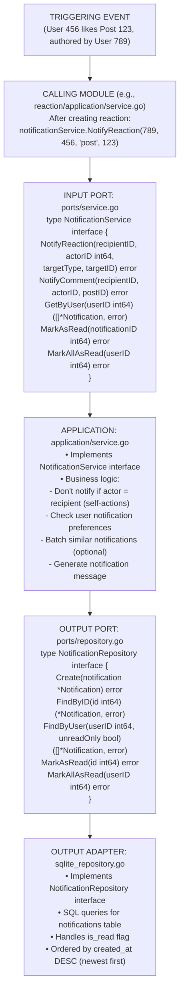
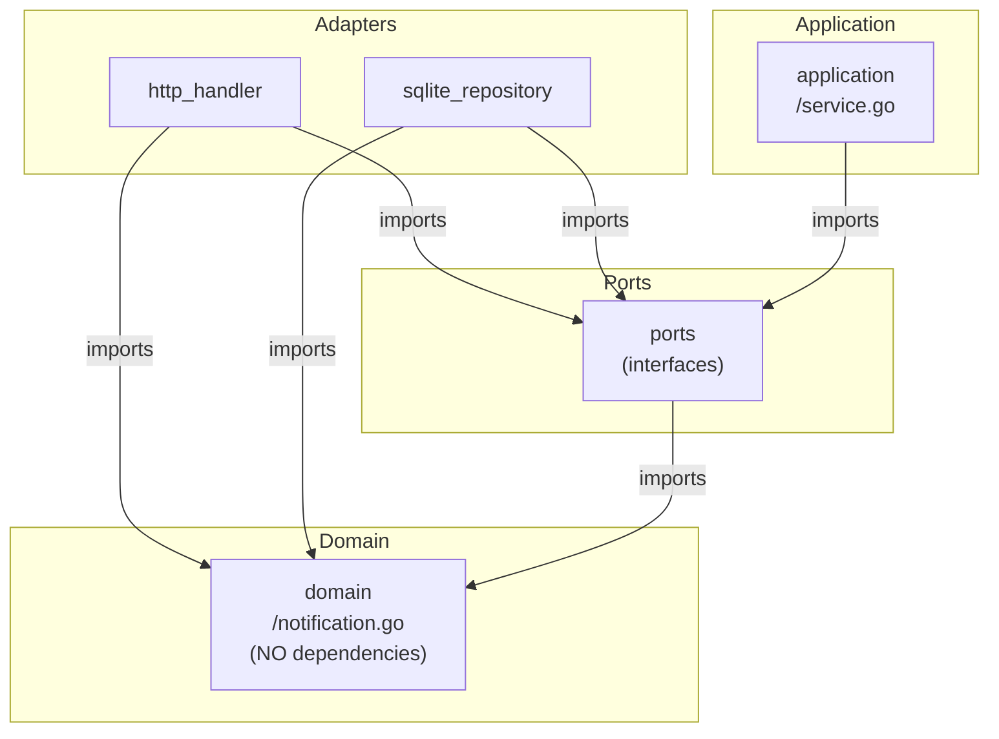
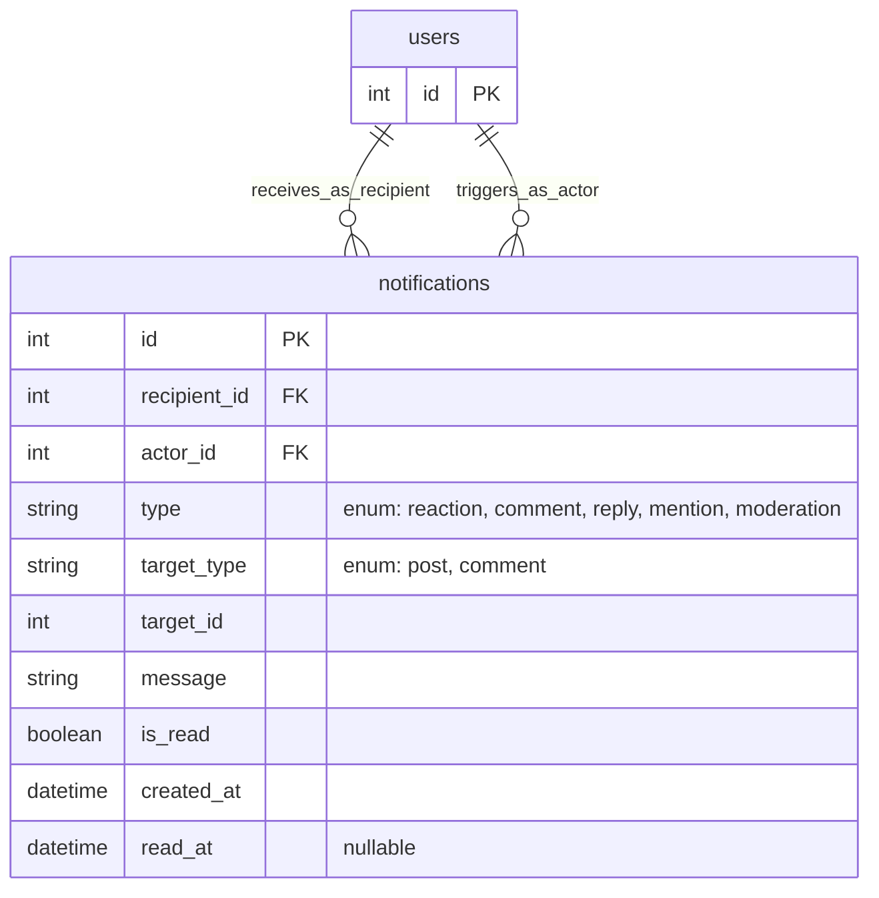

# Notification Module - Information Flow

## Overview

The **notification** module (OPTIONAL) handles user notifications for interactions like reactions, comments, and moderation actions using hexagonal architecture.

## Module Structure

```text
notification/
├── domain/          # Notification entity and business rules
├── ports/           # Service and repository interfaces
├── application/     # Business orchestration
└── adapters/        # HTTP handlers and SQLite repository
```

## Information Flow

### Request Flow (Create Notification Example)

```text
1. Event Trigger (e.g., user reacts to a post)
   ↓
2. Calling Module (e.g., reaction service)
   - After creating reaction, notify post author
   - Call notificationService.NotifyReaction(...)
   ↓
3. INPUT PORT (ports/service.go)
   - NotificationService.NotifyReaction(recipientID, actorID, targetType, targetID)
   ↓
4. APPLICATION (application/service.go)
   - Create notification entity
   - Check if recipient wants this notification type
   ↓
5. OUTPUT PORT (ports/repository.go)
   - NotificationRepository.Create(notification)
   ↓
6. OUTPUT ADAPTER (sqlite_repository.go)
   - INSERT INTO notifications (...)
   ↓
7. DOMAIN (domain/notification.go)
   - Notification entity with read/unread status
   ↓
8. Response flows back
   ↓
9. Notification created (ready for user to view)
```

## Detailed Architecture Diagram



## Dependency Flow

Direction: Everything depends on DOMAIN (center of hexagon)



## Key Components

### Domain Layer (domain/)

**notification.go**:

- Notification entity: ID, RecipientID, ActorID, Type, TargetType, TargetID, Message, IsRead, CreatedAt, ReadAt
- Type enum: Reaction, Comment, Reply, Mention, Moderation
- Validation: Valid type, recipient != actor

**errors.go**:

- `ErrNotificationNotFound`, `ErrInvalidType`

### Ports Layer (ports/)

**service.go** (INPUT PORT):

- Defines notification operations
- Methods: NotifyReaction, NotifyComment, NotifyReply, GetByUser, MarkAsRead, MarkAllAsRead

**repository.go** (OUTPUT PORT):

- Data access contract
- Methods: Create, FindByID, FindByUser, MarkAsRead, MarkAllAsRead, CountUnread

### Application Layer (application/)

**service.go**:

- Implements NotificationService
- Business logic:
  - **Self-action filtering**: Don't notify if actor = recipient
  - **Message generation**: Create human-readable notification messages
  - **Preference checking**: Respect user notification settings
  - **Deduplication**: Optional grouping of similar notifications

### Adapters Layer (adapters/)

**http_handler.go** (INPUT ADAPTER):

- Endpoints:
  - GET /notifications (list user's notifications)
  - PUT /notifications/:id/read (mark as read)
  - PUT /notifications/read-all (mark all as read)
  - GET /notifications/unread/count (unread count)
- Real-time updates (optional): WebSocket or Server-Sent Events (SSE)

**sqlite_repository.go** (OUTPUT ADAPTER):

- SQL for `notifications` table
- Query with JOINs to fetch actor username for display
- Efficient unread count queries

## Data Flow Examples

### Example 1: User Reacts to Post → Notify Post Author

```text
User 456 likes Post 123 (authored by User 789)

reactionService.Toggle(456, "post", 123, "like")
  • Create reaction in database
  • Post-creation hook:
         ↓
postService.GetByID(123)
  • Get post author: post.UserID = 789
         ↓
notificationService.NotifyReaction(789, 456, "post", 123)
  • recipientID = 789 (post author)
  • actorID = 456 (user who liked)
  • targetType = "post"
  • targetID = 123
         ↓
Application logic:
  • Check: 789 != 456? YES (not self-action)
  • Generate message: "User456 liked your post"
  • Create notification entity
         ↓
notificationRepo.Create(&Notification{
  RecipientID: 789,
  ActorID: 456,
  Type: "reaction",
  TargetType: "post",
  TargetID: 123,
  Message: "User456 liked your post",
  IsRead: false,
  CreatedAt: now(),
})
  • SQL: INSERT INTO notifications (...)
         ↓
Notification created
User 789 will see notification when they next visit
```

### Example 2: User Comments on Post → Notify Post Author

```text
User 999 comments on Post 123 (authored by User 789)

commentService.Create(123, 999, "Great post!", nil)
  • Create comment in database
  • Post-creation hook:
         ↓
postService.GetByID(123)
  • Get post author: post.UserID = 789
         ↓
notificationService.NotifyComment(789, 999, 123)
  • recipientID = 789 (post author)
  • actorID = 999 (commenter)
  • postID = 123
         ↓
Application logic:
  • Check: 789 != 999? YES (not self-action)
  • Generate message: "User999 commented on your post"
         ↓
notificationRepo.Create(&Notification{
  RecipientID: 789,
  ActorID: 999,
  Type: "comment",
  TargetType: "post",
  TargetID: 123,
  Message: "User999 commented on your post",
  IsRead: false,
  CreatedAt: now(),
})
         ↓
Notification created
```

### Example 3: User Views Notifications

```text
GET /api/notifications
(User 789 is logged in)

         ↓

http_handler.ListNotifications()
  • userID = 789 (from session)
  • Query param: unread_only = false (default: show all)
         ↓

notificationService.GetByUser(789, false)
         ↓

notificationRepo.FindByUser(789, false)
  • SQL:
    SELECT n.*, u.username as actor_username
    FROM notifications n
    JOIN users u ON n.actor_id = u.id
    WHERE n.recipient_id = 789
    ORDER BY n.created_at DESC
    LIMIT 50
         ↓

[]*Notification with actor info
         ↓

200 OK
[
  {id: 1, actor: "User456", type: "reaction", message: "User456 liked your post", is_read: false, created_at: "..."},
  {id: 2, actor: "User999", type: "comment", message: "User999 commented on your post", is_read: false, created_at: "..."}
]
```

### Example 4: Mark Notification as Read

```text
PUT /api/notifications/1/read
(User 789 is logged in)

         ↓

http_handler.MarkNotificationAsRead()
  • notificationID = 1
  • userID = 789 (from session)
         ↓

notificationService.MarkAsRead(1)
  • Fetch notification: notificationRepo.FindByID(1)
  • Verify ownership: notification.RecipientID == 789
  • Update is_read flag
         ↓

notificationRepo.MarkAsRead(1)
  • SQL: UPDATE notifications SET is_read = true, read_at = ? WHERE id = 1
         ↓

200 OK
```

### Example 5: Mark All as Read

```text
PUT /api/notifications/read-all
(User 789 is logged in)

         ↓

http_handler.MarkAllAsRead()
  • userID = 789 (from session)
         ↓

notificationService.MarkAllAsRead(789)
         ↓

notificationRepo.MarkAllAsRead(789)
  • SQL: UPDATE notifications SET is_read = true, read_at = ? WHERE recipient_id = 789 AND is_read = false
         ↓

200 OK
{marked: 5}  (number of notifications marked)
```

### Example 6: Get Unread Count (for UI Badge)

```text
GET /api/notifications/unread/count
(User 789 is logged in)

         ↓

http_handler.GetUnreadCount()
  • userID = 789 (from session)
         ↓

notificationService.GetUnreadCount(789)
         ↓

notificationRepo.CountUnread(789)
  • SQL: SELECT COUNT(*) FROM notifications WHERE recipient_id = 789 AND is_read = false
  → Returns 3
         ↓

200 OK
{count: 3}
```

## Notification Types

### Supported Notification Events

```text
┌────────────────┬─────────────────────────────────────────┐
│ Type           │ Trigger                                 │
├────────────────┼─────────────────────────────────────────┤
│ Reaction       │ Someone reacts to your post/comment     │
│ Comment        │ Someone comments on your post            │
│ Reply          │ Someone replies to your comment          │
│ Mention        │ Someone mentions you (@username)         │
│ Moderation     │ Your content was moderated               │
└────────────────┴─────────────────────────────────────────┘
```

### Notification Message Templates

```text
Reaction:  "{Actor} liked your {target_type}"
           "{Actor} disliked your {target_type}"

Comment:   "{Actor} commented on your post"

Reply:     "{Actor} replied to your comment"

Mention:   "{Actor} mentioned you in a {target_type}"

Moderation: "Your {target_type} was removed by a moderator"
            "Your report was reviewed"
```

## Cross-Module Integration

### How Other Modules Trigger Notifications

```text
┌─────────────────┐
│ Reaction Module │
└────────┬────────┘
         │ After creating reaction:
         └──→ notificationService.NotifyReaction(...)

┌─────────────────┐
│ Comment Module  │
└────────┬────────┘
         │ After creating comment:
         ├──→ notificationService.NotifyComment(...)  (to post author)
         └──→ notificationService.NotifyReply(...)    (if parent comment exists)

┌─────────────────┐
│Moderation Module│
└────────┬────────┘
         │ After reviewing report:
         ├──→ notificationService.NotifyModeration(...) (to content author)
         └──→ notificationService.NotifyReportReviewed(...) (to reporter)
```

**Pattern**: Calling modules import `notification/ports` and use the service interface.

## Database Schema Relationships



## Real-Time Notifications (Optional Enhancement)

### Polling Approach (Simple)

```text
Frontend polls: GET /api/notifications/unread/count every 30 seconds
If count > 0: Fetch notifications
```

### WebSocket Approach (Real-time)

```text
1. User connects: WebSocket /ws/notifications
2. Server maintains connection map: userID → WebSocket
3. When notification created:
   • Look up recipient's WebSocket
   • Send notification JSON over WebSocket
4. Frontend displays immediately
```

### Server-Sent Events (SSE) Approach

```text
1. User subscribes: GET /sse/notifications (keeps connection open)
2. Server sends events when notifications are created
3. Frontend listens for SSE events and updates UI
```

## Self-Action Prevention

```text
Business Rule: Don't notify users about their own actions

Example:
  User 789 likes their own post
         ↓
  notificationService.NotifyReaction(789, 789, "post", 123)
         ↓
  Application checks: recipientID == actorID?
    YES → Skip notification creation (return early)
    NO → Create notification
```

## Why This Architecture?

1. **Decoupled Events**: Modules trigger notifications without knowing implementation details
2. **Flexible Delivery**: Easy to add email, push notifications, SMS alongside database storage
3. **Testability**: Notification logic testable without HTTP or database
4. **User Control**: Easy to add notification preferences (disable certain types)

## Module Dependencies

Notification module imports:

- ✅ `platform/database` - Database connection
- ✅ `platform/logger` - Logging
- ✅ `internal/modules/user/ports` - UserService interface (get actor username)
- ✅ `internal/modules/post/ports` - PostService interface (optional, for context)

Notification module is imported by:

- ✅ `reaction/application` - Triggers reaction notifications
- ✅ `comment/application` - Triggers comment/reply notifications
- ✅ `moderation/application` - Triggers moderation notifications

Notification module does NOT import:

- ❌ Other module adapters or applications (only ports)

---

## Detailed Walk-Through: How Notifications Are Triggered (For Junior Developers)

This shows how **other modules trigger notifications** and the complete notification lifecycle.

### Where Are API Routes Registered?

**File: `internal/modules/notification/adapters/http_handler.go`**

```go
func (h *Handler) RegisterRoutes(mux *http.ServeMux) {
    mux.HandleFunc("GET /api/notifications", h.ListNotifications)              // List user's notifications
    mux.HandleFunc("PUT /api/notifications/{id}/read", h.MarkAsRead)           // Mark one as read
    mux.HandleFunc("PUT /api/notifications/read-all", h.MarkAllAsRead)         // Mark all as read
    mux.HandleFunc("GET /api/notifications/unread/count", h.GetUnreadCount)    // Get unread count
}
```

### Complete Flow: Reaction → Notification → User Sees It

**Scenario**: User 456 likes Post 123 (authored by User 789), triggering a notification.

#### Step 1: Reaction Module Calls Notification Service

**File: `internal/modules/reaction/application/service.go`** (calling module)

```go
func (s *service) Toggle(ctx context.Context, userID int64, targetType string, targetID int64, reactionType string) (*domain.Reaction, error) {
    // ... reaction creation logic ...
    
    // After successfully creating reaction:
    if userID != authorID {  // Don't notify self
        // === TRIGGER NOTIFICATION (CROSS-MODULE CALL) ===
        err := s.notifService.NotifyReaction(ctx, authorID, userID, targetType, targetID)
        if err != nil {
            // Log error but don't fail reaction creation
            s.logger.Error("Failed to send notification", logger.Error(err))
        }
    }
    
    return reaction, nil
}
```

#### Step 2: Notification Service Creates Notification

**File: `internal/modules/notification/application/service.go`**

```go
type service struct {
    notificationRepo ports.NotificationRepository
    userService      userports.UserService  // To get actor username
    logger           *logger.Logger
}

func (s *service) NotifyReaction(
    ctx context.Context,
    recipientID, actorID int64,
    targetType string,
    targetID int64,
) error {
    
    // === STEP 1: Prevent Self-Notification ===
    if recipientID == actorID {
        return nil  // Don't notify self
    }
    
    // === STEP 2: Get Actor Info (CROSS-MODULE) ===
    actor, err := s.userService.GetByID(ctx, actorID)
    if err != nil {
        return fmt.Errorf("failed to get actor: %w", err)
    }
    
    // === STEP 3: Generate Message ===
    var message string
    switch targetType {
    case "post":
        message = fmt.Sprintf("%s liked your post", actor.Username)
    case "comment":
        message = fmt.Sprintf("%s liked your comment", actor.Username)
    }
    
    // === STEP 4: Create Notification Entity ===
    notification := &domain.Notification{
        RecipientID: recipientID,  // User 789 (post author)
        ActorID:     actorID,      // User 456 (who liked)
        Type:        "reaction",
        TargetType:  targetType,   // "post"
        TargetID:    targetID,     // 123
        Message:     message,
        IsRead:      false,
        CreatedAt:   time.Now(),
    }
    
    // Validate
    if err := notification.Validate(); err != nil {
        return err
    }
    
    // === STEP 5: Save to Database ===
    if err := s.notificationRepo.Create(ctx, notification); err != nil {
        return fmt.Errorf("failed to create notification: %w", err)
    }
    
    s.logger.Info("Notification created",
        logger.Int64("recipient_id", recipientID),
        logger.Int64("actor_id", actorID),
        logger.String("type", "reaction"))
    
    return nil
}
```

#### Step 3: Repository Saves Notification

**File: `internal/modules/notification/adapters/sqlite_repository.go`**

```go
func (r *sqliteNotificationRepository) Create(ctx context.Context, notification *domain.Notification) error {
    query := `
        INSERT INTO notifications (
            recipient_id, actor_id, type, target_type, target_id,
            message, is_read, created_at
        ) VALUES (?, ?, ?, ?, ?, ?, ?, ?)
    `
    
    result, err := r.db.ExecContext(ctx, query,
        notification.RecipientID,
        notification.ActorID,
        notification.Type,
        notification.TargetType,
        notification.TargetID,
        notification.Message,
        notification.IsRead,
        notification.CreatedAt,
    )
    
    if err != nil {
        return err
    }
    
    id, err := result.LastInsertId()
    if err != nil {
        return err
    }
    
    notification.ID = id
    return nil
}
```

#### Step 4: User Fetches Notifications

**Later, User 789 visits the site and fetches notifications**

```
GET /api/notifications
```

**File: `internal/modules/notification/adapters/http_handler.go`**

```go
func (h *Handler) ListNotifications(w http.ResponseWriter, r *http.Request) {
    // Get user ID from session
    userID := r.Context().Value("user_id").(int64)
    
    // Optional: filter by unread only
    unreadOnly := r.URL.Query().Get("unread_only") == "true"
    
    // Call service
    notifications, err := h.service.GetByUser(r.Context(), userID, unreadOnly)
    if err != nil {
        h.handleError(w, err)
        return
    }
    
    // Return JSON
    w.WriteHeader(http.StatusOK)
    json.NewEncoder(w).Encode(notifications)
}
```

**File: `internal/modules/notification/application/service.go`**

```go
func (s *service) GetByUser(ctx context.Context, userID int64, unreadOnly bool) ([]*domain.Notification, error) {
    notifications, err := s.notificationRepo.FindByUser(ctx, userID, unreadOnly)
    if err != nil {
        return nil, err
    }
    
    return notifications, nil
}
```

**File: `internal/modules/notification/adapters/sqlite_repository.go`**

```go
func (r *sqliteNotificationRepository) FindByUser(
    ctx context.Context,
    userID int64,
    unreadOnly bool,
) ([]*domain.Notification, error) {
    query := `
        SELECT 
            n.id, n.recipient_id, n.actor_id, n.type,
            n.target_type, n.target_id, n.message,
            n.is_read, n.created_at, n.read_at,
            u.username as actor_username
        FROM notifications n
        JOIN users u ON n.actor_id = u.id
        WHERE n.recipient_id = ?
    `
    
    if unreadOnly {
        query += " AND n.is_read = false"
    }
    
    query += " ORDER BY n.created_at DESC LIMIT 50"
    
    rows, err := r.db.QueryContext(ctx, query, userID)
    if err != nil {
        return nil, err
    }
    defer rows.Close()
    
    var notifications []*domain.Notification
    for rows.Next() {
        var n domain.Notification
        var actorUsername string
        
        err := rows.Scan(
            &n.ID, &n.RecipientID, &n.ActorID, &n.Type,
            &n.TargetType, &n.TargetID, &n.Message,
            &n.IsRead, &n.CreatedAt, &n.ReadAt,
            &actorUsername,
        )
        if err != nil {
            return nil, err
        }
        
        // Can attach actor username for display
        notifications = append(notifications, &n)
    }
    
    return notifications, nil
}
```

#### Step 5: User Clicks Notification (Mark as Read)

```
PUT /api/notifications/999/read
```

**File: `internal/modules/notification/adapters/http_handler.go`**

```go
func (h *Handler) MarkAsRead(w http.ResponseWriter, r *http.Request) {
    userID := r.Context().Value("user_id").(int64)
    
    notificationID, err := strconv.ParseInt(r.PathValue("id"), 10, 64)
    if err != nil {
        http.Error(w, "Invalid notification ID", http.StatusBadRequest)
        return
    }
    
    // Call service
    if err := h.service.MarkAsRead(r.Context(), notificationID, userID); err != nil {
        h.handleError(w, err)
        return
    }
    
    w.WriteHeader(http.StatusOK)
}
```

**File: `internal/modules/notification/application/service.go`**

```go
func (s *service) MarkAsRead(ctx context.Context, notificationID, userID int64) error {
    // Verify notification belongs to user
    notification, err := s.notificationRepo.FindByID(ctx, notificationID)
    if err != nil {
        return err
    }
    
    if notification.RecipientID != userID {
        return domain.ErrUnauthorized
    }
    
    // Mark as read
    return s.notificationRepo.MarkAsRead(ctx, notificationID)
}
```

**File: `internal/modules/notification/adapters/sqlite_repository.go`**

```go
func (r *sqliteNotificationRepository) MarkAsRead(ctx context.Context, id int64) error {
    query := `
        UPDATE notifications
        SET is_read = true, read_at = ?
        WHERE id = ?
    `
    
    _, err := r.db.ExecContext(ctx, query, time.Now(), id)
    return err
}
```

### Summary: Complete Notification Lifecycle

```text
=== NOTIFICATION CREATION ===

1. User 456 likes Post 123 (authored by User 789)
   ↓
2. reaction/application/service.go → Toggle()
   • Create reaction
   • Get post author ID (789)
   ↓
3. reaction/application/service.go → s.notifService.NotifyReaction(789, 456, "post", 123)
   ↓
4. notification/application/service.go → NotifyReaction(789, 456, "post", 123)
   ↓
   ├→ Check: 789 != 456? YES (not self)
   │
   ├→ CROSS-MODULE: user/application/service.go → GetByID(456)
   │  ↓ Get username: "User456"
   │
   ├→ Generate message: "User456 liked your post"
   │
   └→ notification/adapters/sqlite_repository.go → Create(notification)
      SQL: INSERT INTO notifications (recipient_id, actor_id, message, is_read, ...)
           VALUES (789, 456, 'User456 liked your post', false, ...)

=== USER VIEWS NOTIFICATION ===

5. User 789 visits site, frontend polls: GET /api/notifications
   ↓
6. notification/adapters/http_handler.go → ListNotifications(w, r)
   ↓
7. notification/application/service.go → GetByUser(789, false)
   ↓
8. notification/adapters/sqlite_repository.go → FindByUser(789, false)
   SQL: SELECT n.*, u.username
        FROM notifications n
        JOIN users u ON n.actor_id = u.id
        WHERE n.recipient_id = 789
        ORDER BY n.created_at DESC
   ↓
9. Return JSON: [{id: 999, message: "User456 liked your post", is_read: false, ...}]

=== USER MARKS AS READ ===

10. User clicks notification: PUT /api/notifications/999/read
    ↓
11. notification/adapters/http_handler.go → MarkAsRead(w, r)
    ↓
12. notification/application/service.go → MarkAsRead(999, 789)
    • Verify notification belongs to user 789
    ↓
13. notification/adapters/sqlite_repository.go → MarkAsRead(999)
    SQL: UPDATE notifications SET is_read = true, read_at = ? WHERE id = 999
    ↓
14. Return 200 OK
```

### How Different Modules Trigger Notifications

```text
┌──────────────────┐
│ Reaction Module  │ → NotifyReaction(recipientID, actorID, targetType, targetID)
└──────────────────┘   "User456 liked your post"

┌──────────────────┐
│ Comment Module   │ → NotifyComment(recipientID, actorID, postID)
└──────────────────┘   "User456 commented on your post"
                    → NotifyReply(recipientID, actorID, commentID)
                      "User456 replied to your comment"

┌──────────────────┐
│Moderation Module │ → NotifyModeration(recipientID, targetType, targetID, action)
└──────────────────┘   "Your post was removed by a moderator"
                    → NotifyReportReviewed(reporterID, reportID)
                      "Your report was reviewed"
```

### Dependency Injection

**File: `cmd/forum/wire/services.go`**

```go
// Notification service receives minimal dependencies
func initNotificationService(
    notificationRepo ports.NotificationRepository,
    userService userports.UserService,  // To get actor username
    logger *logger.Logger,
) ports.NotificationService {
    return notification.NewService(notificationRepo, userService, logger)
}

// Other services receive notification service
func initReactionService(
    reactionRepo ports.ReactionRepository,
    notifService notifports.NotificationService,  // ← Injected
    // ... other deps
) ports.ReactionService {
    return reaction.NewService(reactionRepo, notifService, ...)
}
```

### Key Concepts for Junior Developers

1. **Event-Driven Pattern**: Other modules call notification service after successful operations
2. **Decoupling**: Notification failures don't fail the original operation (reaction still created)
3. **Self-Prevention**: Business rule prevents notifying users about their own actions
4. **Cross-Module Data**: Gets actor username via UserService interface
5. **Unread Badge**: Frontend polls `/api/notifications/unread/count` for UI badge
6. **Graceful Degradation**: If notification creation fails, log error but continue
7. **User Control**: Easy to add notification preferences (filter by type, disable, etc.)

This pattern allows all modules to trigger notifications without tight coupling!

## Future Enhancements

1. **Email Notifications**: Send digest emails for unread notifications
2. **Push Notifications**: Browser/mobile push notifications
3. **Notification Preferences**: Let users configure which notifications they receive
4. **Batching**: Group similar notifications ("User1 and 5 others liked your post")
5. **Read Receipts**: Track when notifications were actually seen
