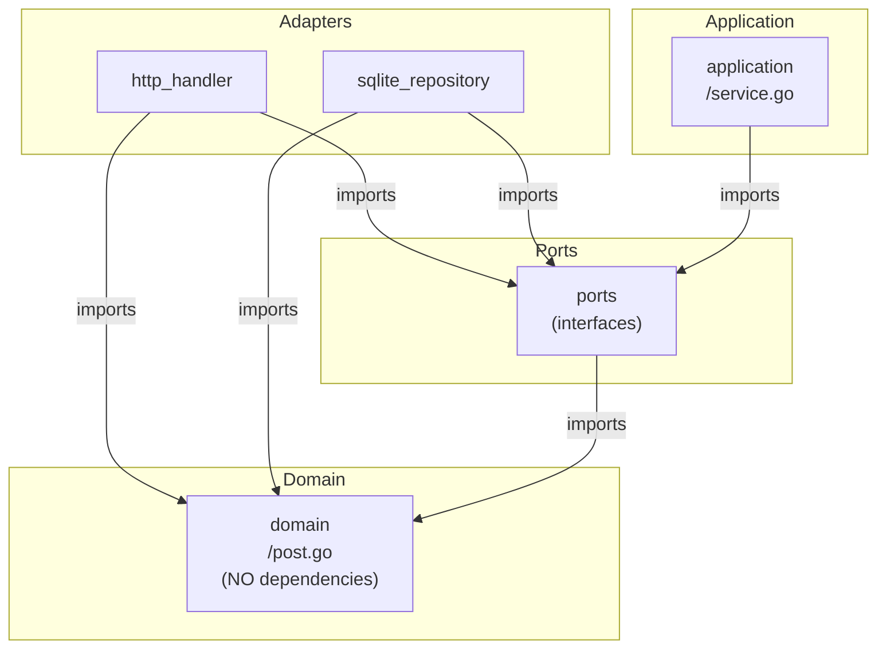
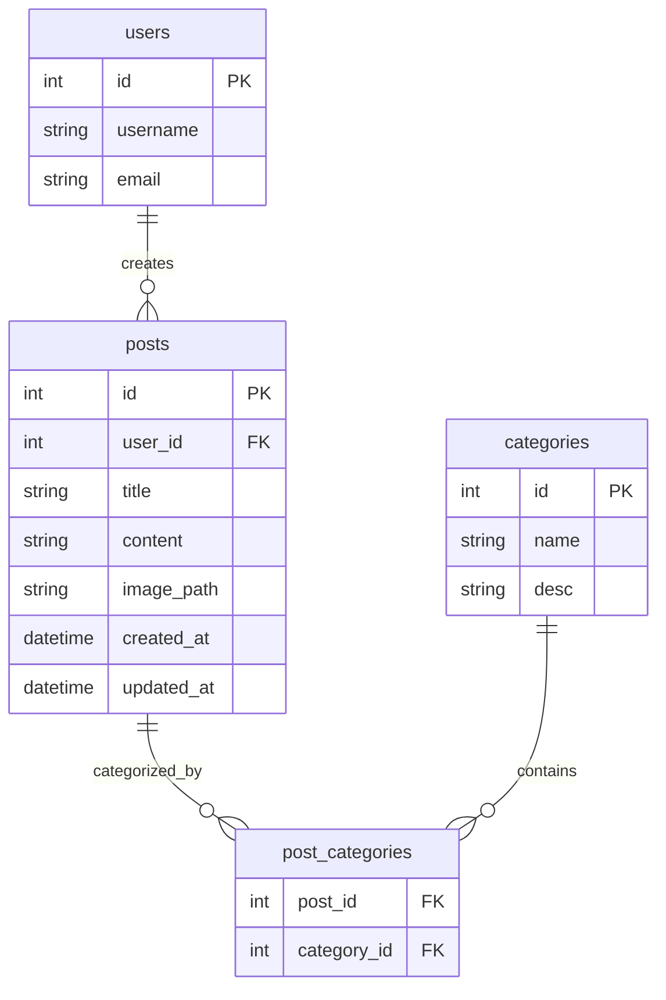

# Post Module - Information Flow

## Overview

The **post** module handles forum posts and categories using hexagonal architecture. It manages post creation, reading, filtering, and categorization.

## Module Structure

```text
post/
├── domain/          # Post and Category entities
├── ports/           # Service and repository interfaces
├── application/     # Business orchestration
└── adapters/        # HTTP handlers and SQLite repository
```

## Information Flow

### Request Flow (Create Post Example)

```text
1. HTTP Request: POST /api/posts
   Body: {title, content, categories, image}
   ↓
2. INPUT ADAPTER (http_handler.go)
   - Parse multipart form data
   - Validate image upload
   - Call service.Create(postData)
   ↓
3. INPUT PORT (ports/service.go)
   - PostService.Create(data)
   ↓
4. APPLICATION (application/service.go)
   - Validate user permissions
   - Handle image upload
   - Create post entity (domain)
   - Associate categories
   ↓
5. OUTPUT PORT (ports/repository.go)
   - PostRepository.Create(post)
   - PostRepository.AddCategories(postID, categoryIDs)
   ↓
6. OUTPUT ADAPTER (sqlite_repository.go)
   - INSERT INTO posts (...)
   - INSERT INTO post_categories (...)
   ↓
7. DOMAIN (domain/post.go, domain/category.go)
   - Post entity with validation
   - Category entity
   ↓
8. Response flows back
   ↓
9. HTTP Response: 201 Created with post data
```

## Detailed Architecture Diagram

```mermaid
flowchart TD
    A["HTTP CLIENT<br/>POST /api/posts<br/>{title: '...', content: '...', categories: [1,2]}"] --> B["INPUT ADAPTER: http_handler.go<br/>• CreatePost(w, r)<br/>• Parse form data (multipart for images)<br/>• Validate input<br/>• Extract user from session<br/>• Call postService.Create(...)"]
    B --> C["INPUT PORT: ports/service.go<br/>type PostService interface {<br/>Create(data CreatePostData) (*Post, error)<br/>GetByID(id int64) (*Post, error)<br/>List(filters ListFilters) ([]*Post, error)<br/>Update(id int64, data UpdateData) error<br/>Delete(id int64, userID int64) error<br/>GetByCategory(categoryID int64) ([]*Post, error)<br/>}"]
    C --> D["APPLICATION: application/service.go<br/>• Implements PostService interface<br/>• Business logic:<br/>- Check user owns post (for edit/delete)<br/>- Validate categories exist<br/>- Handle image upload<br/>- Enforce post constraints<br/>• Uses PostRepository interface"]
    D --> E["OUTPUT PORT: ports/repository.go<br/>type PostRepository interface {<br/>Create(post *Post) error<br/>FindByID(id int64) (*Post, error)<br/>FindAll(filters Filters) ([]*Post, error)<br/>Update(post *Post) error<br/>Delete(id int64) error<br/>AddCategories(postID int64, catIDs []int64) error<br/>GetCategories(postID int64) ([]*Category, error)<br/>}"]
    E --> F["OUTPUT ADAPTER: sqlite_repository.go<br/>• Implements PostRepository interface<br/>• SQL queries:<br/>- INSERT INTO posts (...)<br/>- SELECT * FROM posts WHERE ...<br/>- JOIN post_categories for filtering<br/>• Row mapping to domain entities"]
```



## Dependency Flow

Direction: Everything depends on DOMAIN (center of hexagon)



## Key Components

### Domain Layer (domain/)

**post.go**:

- Post entity: ID, UserID, Title, Content, ImagePath, CreatedAt, UpdatedAt
- Validation: Title length (3-200 chars), content not empty
- Business rules for ownership

**category.go**:

- Category entity: ID, Name, Description
- Predefined categories (or user-created)

**errors.go**:

- `ErrPostNotFound`, `ErrUnauthorized`, `ErrInvalidCategory`

### Ports Layer (ports/)

**service.go** (INPUT PORT):

- Defines post operations
- Methods: Create, GetByID, List, Update, Delete, GetByCategory, GetByUser

**repository.go** (OUTPUT PORT):

- Data access contract
- Methods: Create, FindByID, FindAll, Update, Delete, AddCategories

### Application Layer (application/)

**service.go**:

- Implements PostService
- Business logic:
  - User can only edit/delete own posts
  - Categories must exist before association
  - Image upload validation (size, format)
  - Filtering logic (by category, by user, by liked)

### Adapters Layer (adapters/)

**http_handler.go** (INPUT ADAPTER):

- Endpoints: POST /posts, GET /posts, GET /posts/:id, PUT /posts/:id, DELETE /posts/:id
- Handles multipart form data for image uploads
- Query parameters for filtering (?category=1&user=5)

**sqlite_repository.go** (OUTPUT ADAPTER):

- SQL for `posts` and `post_categories` tables
- Joins for fetching posts with categories
- Transaction handling for multi-table operations

## Data Flow Examples

### Example 1: Create Post with Categories

```text
POST /api/posts
FormData:
  - title: "My Post"
  - content: "Content here"
  - categories: [1, 3]
  - image: file.jpg

         ↓

http_handler.CreatePost()
  • Parse multipart form
  • Extract session (get userID)
  • Validate image (max 20MB, valid format)
         ↓

postService.Create(CreatePostData{
  UserID: 123,
  Title: "My Post",
  Content: "Content here",
  CategoryIDs: [1, 3],
  Image: imageFile,
})
  • Save image to static/uploads/
  • Create domain.Post entity
  • Validate categories exist
         ↓

postRepo.Create(post)
  • SQL: INSERT INTO posts (user_id, title, content, image_path, created_at)
  • Get generated post ID
         ↓

postRepo.AddCategories(postID, [1, 3])
  • SQL: INSERT INTO post_categories (post_id, category_id) VALUES ...
         ↓

201 Created
{id: 456, title: "My Post", user_id: 123, ...}
```

### Example 2: List Posts Filtered by Category

```text
GET /api/posts?category=2

         ↓

http_handler.ListPosts()
  • Parse query params
  • Extract categoryID = 2
         ↓

postService.GetByCategory(2)
  • Build filter criteria
         ↓

postRepo.FindAll(Filters{CategoryID: 2})
  • SQL:
    SELECT p.*
    FROM posts p
    JOIN post_categories pc ON p.id = pc.post_id
    WHERE pc.category_id = 2
    ORDER BY p.created_at DESC
         ↓

[]*domain.Post
         ↓

200 OK
[{id: 1, title: "..."}, {id: 5, title: "..."}]
```

### Example 3: Delete Post (Authorization)

```text
DELETE /api/posts/456
(User 123 is logged in)

         ↓

http_handler.DeletePost()
  • Extract post ID = 456
  • Extract user ID = 123 from session
         ↓

postService.Delete(456, 123)
  • Fetch post from repository
  • Check: post.UserID == 123?
    - YES: Proceed
    - NO: Return ErrUnauthorized
         ↓

postRepo.Delete(456)
  • SQL: DELETE FROM posts WHERE id = 456
  • Cascade deletes post_categories entries
         ↓

204 No Content
```

## Cross-Module Communication

Post module may interact with other modules:

```text
postService.GetByID(postID)
    ↓
commentService.GetByPostID(postID)  ← Get comments for post
    ↓
reactionService.GetByPostID(postID) ← Get reaction counts
    ↓
Aggregate and return full post data
```

**Pattern**: Always via service interfaces (INPUT PORTS), never direct repository access.

## Database Schema Relationships



## Why This Architecture?

1. **Business Logic Isolation**: Post validation rules in domain, independent of storage
2. **Flexible Filtering**: Easy to add new filter criteria without changing handlers
3. **Image Handling**: Abstracted in application layer, adapters just save files
4. **Testability**: Mock PostRepository to test service logic

## Module Dependencies

Post module imports:

- ✅ `platform/database` - Database connection
- ✅ `platform/logger` - Logging
- ✅ `internal/modules/user/ports` - User service interface (for validation)
- ✅ `mime/multipart` - File upload handling

Post module does NOT import:

- ❌ Other module adapters/applications (only ports)

---

## Detailed Walk-Through: Create Post with Image Upload (For Junior Developers)

This shows **exact files**, **functions**, and how **multipart form data** is handled.

### Where Are API Routes Registered?

**File: `internal/modules/post/adapters/http_handler.go`**

```go
func (h *Handler) RegisterRoutes(mux *http.ServeMux) {
    mux.HandleFunc("POST /api/posts", h.CreatePost)           // Create post
    mux.HandleFunc("GET /api/posts", h.ListPosts)             // List with filters
    mux.HandleFunc("GET /api/posts/{id}", h.GetPost)          // Get single post
    mux.HandleFunc("PUT /api/posts/{id}", h.UpdatePost)       // Update post
    mux.HandleFunc("DELETE /api/posts/{id}", h.DeletePost)    // Delete post
}
```

### Complete Flow: Create Post with Image and Categories

**Scenario**: User 123 creates a post with an image and 2 categories.

#### Step 1: HTTP Request (Multipart Form Data)

```
POST /api/posts
Content-Type: multipart/form-data

Fields:
  - title: "My Amazing Post"
  - content: "This is the content..."
  - categories: [1, 3]  (JSON array)
  - image: [binary file data - photo.jpg]
```

**File: `internal/modules/post/adapters/http_handler.go`**

```go
func (h *Handler) CreatePost(w http.ResponseWriter, r *http.Request) {
    // 1. Parse multipart form (max 20MB)
    if err := r.ParseMultipartForm(20 << 20); err != nil {
        http.Error(w, "File too large", http.StatusRequestEntityTooLarge)
        return
    }
    
    // 2. Get user ID from session
    userID := r.Context().Value("user_id").(int64)
    
    // 3. Extract form fields
    title := r.FormValue("title")
    content := r.FormValue("content")
    
    // 4. Parse category IDs (JSON array)
    var categoryIDs []int64
    if err := json.Unmarshal([]byte(r.FormValue("categories")), &categoryIDs); err != nil {
        http.Error(w, "Invalid categories", http.StatusBadRequest)
        return
    }
    
    // 5. Handle image upload
    var imagePath string
    file, header, err := r.FormFile("image")
    if err == nil {
        defer file.Close()
        
        // Validate image type
        contentType := header.Header.Get("Content-Type")
        if !isValidImageType(contentType) {
            http.Error(w, "Invalid image type", http.StatusBadRequest)
            return
        }
        
        // Save file (handled by service)
        imagePath = fmt.Sprintf("uploads/%d_%s", time.Now().Unix(), header.Filename)
    }
    
    // 6. Call service
    post, err := h.service.Create(r.Context(), CreatePostData{
        UserID:      userID,
        Title:       title,
        Content:     content,
        CategoryIDs: categoryIDs,
        ImageFile:   file,
        ImagePath:   imagePath,
    })
    
    if err != nil {
        h.handleError(w, err)
        return
    }
    
    // 7. Return created post
    w.WriteHeader(http.StatusCreated)
    json.NewEncoder(w).Encode(post)
}
```

#### Step 2: Service Validates and Saves Image

**File: `internal/modules/post/application/service.go`**

```go
type service struct {
    postRepo        ports.PostRepository
    categoryService categoryports.CategoryService  // To validate categories exist
    uploadDir       string
    logger          *logger.Logger
}

func (s *service) Create(ctx context.Context, data CreatePostData) (*domain.Post, error) {
    // 1. Validate categories exist (CROSS-MODULE CALL)
    for _, catID := range data.CategoryIDs {
        if _, err := s.categoryService.GetByID(ctx, catID); err != nil {
            return nil, fmt.Errorf("invalid category %d: %w", catID, err)
        }
    }
    
    // 2. Save image file to disk
    var imagePath string
    if data.ImageFile != nil {
        imagePath = filepath.Join(s.uploadDir, data.ImagePath)
        
        // Create upload directory if needed
        if err := os.MkdirAll(filepath.Dir(imagePath), 0755); err != nil {
            return nil, fmt.Errorf("failed to create upload dir: %w", err)
        }
        
        // Save file
        dst, err := os.Create(imagePath)
        if err != nil {
            return nil, fmt.Errorf("failed to create file: %w", err)
        }
        defer dst.Close()
        
        if _, err := io.Copy(dst, data.ImageFile); err != nil {
            return nil, fmt.Errorf("failed to save file: %w", err)
        }
        
        s.logger.Info("Image saved", logger.String("path", imagePath))
    }
    
    // 3. Create post entity (domain logic)
    post := &domain.Post{
        UserID:    data.UserID,
        Title:     data.Title,
        Content:   data.Content,
        ImagePath: imagePath,
        CreatedAt: time.Now(),
        UpdatedAt: time.Now(),
    }
    
    // Validate (domain business rules)
    if err := post.Validate(); err != nil {
        // Clean up uploaded file if validation fails
        if imagePath != "" {
            os.Remove(imagePath)
        }
        return nil, err
    }
    
    // 4. Start transaction (for post + categories)
    tx, err := s.postRepo.BeginTx(ctx)
    if err != nil {
        return nil, err
    }
    defer tx.Rollback()
    
    // 5. Save post
    if err := s.postRepo.CreateWithTx(ctx, tx, post); err != nil {
        return nil, fmt.Errorf("failed to create post: %w", err)
    }
    
    // 6. Associate categories
    if len(data.CategoryIDs) > 0 {
        if err := s.postRepo.AddCategoriesWithTx(ctx, tx, post.ID, data.CategoryIDs); err != nil {
            return nil, fmt.Errorf("failed to add categories: %w", err)
        }
    }
    
    // 7. Commit transaction
    if err := tx.Commit(); err != nil {
        return nil, fmt.Errorf("failed to commit: %w", err)
    }
    
    s.logger.Info("Post created",
        logger.Int64("post_id", post.ID),
        logger.Int64("user_id", data.UserID))
    
    return post, nil
}
```

#### Step 3: Domain Validation

**File: `internal/modules/post/domain/post.go`**

```go
func (p *Post) Validate() error {
    // Title: 3-200 characters
    if len(strings.TrimSpace(p.Title)) < 3 {
        return ErrTitleTooShort
    }
    if len(p.Title) > 200 {
        return ErrTitleTooLong
    }
    
    // Content: not empty
    if strings.TrimSpace(p.Content) == "" {
        return ErrEmptyContent
    }
    
    // UserID must be positive
    if p.UserID <= 0 {
        return ErrInvalidUser
    }
    
    return nil
}
```

#### Step 4: Repository with Transaction

**File: `internal/modules/post/adapters/sqlite_repository.go`**

```go
func (r *sqlitePostRepository) CreateWithTx(
    ctx context.Context,
    tx *sql.Tx,
    post *domain.Post,
) error {
    query := `
        INSERT INTO posts (user_id, title, content, image_path, created_at, updated_at)
        VALUES (?, ?, ?, ?, ?, ?)
    `
    
    result, err := tx.ExecContext(ctx, query,
        post.UserID,
        post.Title,
        post.Content,
        post.ImagePath,
        post.CreatedAt,
        post.UpdatedAt,
    )
    
    if err != nil {
        return err
    }
    
    id, err := result.LastInsertId()
    if err != nil {
        return err
    }
    
    post.ID = id
    return nil
}

func (r *sqlitePostRepository) AddCategoriesWithTx(
    ctx context.Context,
    tx *sql.Tx,
    postID int64,
    categoryIDs []int64,
) error {
    query := `INSERT INTO post_categories (post_id, category_id) VALUES (?, ?)`
    
    for _, catID := range categoryIDs {
        if _, err := tx.ExecContext(ctx, query, postID, catID); err != nil {
            return err
        }
    }
    
    return nil
}
```

### Summary: Function Call Chain

```text
1. POST /api/posts (multipart form data)
   ↓
2. post/adapters/http_handler.go → CreatePost(w, r)
   • ParseMultipartForm(20MB)
   • Extract title, content, categories
   • Extract image file
   ↓
3. post/application/service.go → Create(ctx, CreatePostData)
   ↓
   ├→ CROSS-MODULE: category service validates each category exists
   │
   ├→ Save image file to disk (static/uploads/)
   │  os.Create(imagePath)
   │  io.Copy(dst, imageFile)
   │
   ├→ post/domain/post.go → Validate()
   │  • Title length check
   │  • Content not empty
   │
   ├→ post/adapters/sqlite_repository.go → BeginTx()
   │  Start database transaction
   │
   ├→ post/adapters/sqlite_repository.go → CreateWithTx(tx, post)
   │  SQL: INSERT INTO posts (...)
   │
   ├→ post/adapters/sqlite_repository.go → AddCategoriesWithTx(tx, postID, categoryIDs)
   │  SQL: INSERT INTO post_categories (post_id, category_id) VALUES ...
   │  (Multiple rows)
   │
   └→ Commit transaction
   ↓
4. Return 201 Created with post JSON
```

### Key Concepts for Junior Developers

1. **Multipart Form Data**: Used when uploading files, accessed via `r.FormFile("image")`
2. **Transactions**: Ensure post and categories are saved atomically (all or nothing)
3. **File Handling**: Save to `static/uploads/`, clean up on validation error
4. **Cross-Module Validation**: Call category service to verify categories exist
5. **Domain Validation**: Business rules in domain layer (title length, etc.)
6. **Error Cleanup**: If validation fails after saving image, delete the file
