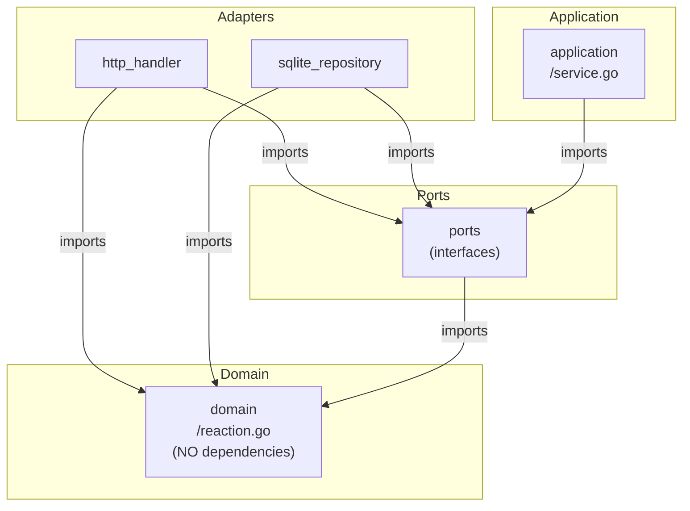
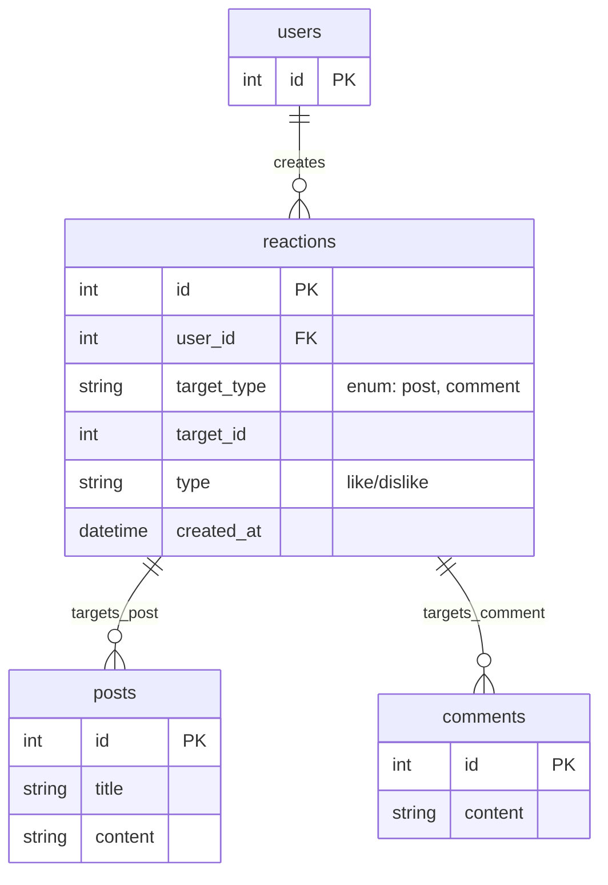

# Reaction Module - Information Flow

## Overview

The **reaction** module handles likes and dislikes on posts and comments using hexagonal architecture. Users can toggle reactions (can't like and dislike simultaneously).

## Module Structure

```text
reaction/
├── domain/          # Reaction entity and business rules
├── ports/           # Service and repository interfaces
├── application/     # Business orchestration
└── adapters/        # HTTP handlers and SQLite repository
```

## Information Flow

### Request Flow (Toggle Reaction Example)

```text
1. HTTP Request: POST /api/reactions
   Body: {target_type: "post", target_id: 123, type: "like"}
   ↓
2. INPUT ADAPTER (http_handler.go)
   - Parse JSON body
   - Extract user ID from session
   - Call service.Toggle(...)
   ↓
3. INPUT PORT (ports/service.go)
   - ReactionService.Toggle(userID, targetType, targetID, reactionType)
   ↓
4. APPLICATION (application/service.go)
   - Check if reaction exists
   - Toggle logic:
     * Same type → Remove reaction
     * Different type → Update reaction
     * No reaction → Create new reaction
   ↓
5. OUTPUT PORT (ports/repository.go)
   - ReactionRepository.FindByUserAndTarget(...)
   - ReactionRepository.Create/Update/Delete(...)
   ↓
6. OUTPUT ADAPTER (sqlite_repository.go)
   - SELECT to check existing reaction
   - INSERT, UPDATE, or DELETE based on logic
   ↓
7. DOMAIN (domain/reaction.go)
   - Reaction entity with validation
   - Type enum: Like, Dislike
   ↓
8. Response flows back
   ↓
9. HTTP Response: 200 OK with updated counts
```

## Detailed Architecture Diagram

```mermaid
flowchart TD
    A["HTTP CLIENT<br/>POST /api/reactions<br/>{target_type: 'post', target_id: 123, type: 'like'}"] --> B["INPUT ADAPTER: http_handler.go<br/>• ToggleReaction(w, r)<br/>• Parse JSON: target_type, target_id, reaction_type<br/>• Extract user_id from session context<br/>• Call reactionService.Toggle(...)"]
    B --> C["INPUT PORT: ports/service.go<br/>type ReactionService interface {<br/>Toggle(userID int64, targetType string,<br/>targetID int64, type ReactionType)<br/>( *Reaction, error)<br/>GetCounts(targetType string, targetID int64)<br/>(likes, dislikes int, error)<br/>GetByUser(userID int64) ([]*Reaction, error)<br/>}"]
    C --> D["APPLICATION: application/service.go<br/>• Implements ReactionService interface<br/>• Toggle logic (same/different/new)<br/>• Business rules:<br/>- Target (post/comment) must exist<br/>- Can't like and dislike simultaneously<br/>- Clicking same reaction removes it"]
    D --> E["OUTPUT PORT: ports/repository.go<br/>type ReactionRepository interface {<br/>Create(reaction *Reaction) error<br/>FindByUserAndTarget(userID, targetType, targetID)<br/>Update(reaction *Reaction) error<br/>Delete(id int64) error<br/>CountByTarget(targetType, targetID, type) (int)<br/>}"]
    E --> F["OUTPUT ADAPTER: sqlite_repository.go<br/>• Implements ReactionRepository interface<br/>• SQL queries for reactions table<br/>• Handles target_type (post/comment) polymorphism<br/>• Aggregate queries for counts"]
```



## Dependency Flow

Direction: Everything depends on DOMAIN (center of hexagon)



## Key Components

### Domain Layer (domain/)

**reaction.go**:

- Reaction entity: ID, UserID, TargetType (post/comment), TargetID, Type (like/dislike), CreatedAt
- ReactionType enum: Like, Dislike
- Validation: Valid target type, valid reaction type

**errors.go**:

- `ErrReactionNotFound`, `ErrInvalidTarget`, `ErrInvalidReactionType`

### Ports Layer (ports/)

**service.go** (INPUT PORT):

- Defines reaction operations
- Methods: Toggle, GetCounts, GetByUser, GetByTarget

**repository.go** (OUTPUT PORT):

- Data access contract
- Methods: Create, FindByUserAndTarget, Update, Delete, CountByTarget

### Application Layer (application/)

**service.go**:

- Implements ReactionService
- Toggle logic:
  1. Find existing reaction
  2. If same type: Delete (toggle off)
  3. If different type: Update to new type
  4. If none: Create new reaction
- Validates target exists (via PostService or CommentService)

### Adapters Layer (adapters/)

**http_handler.go** (INPUT ADAPTER):

- Endpoints: POST /reactions (toggle), DELETE /reactions/:id, GET /posts/:id/reactions, GET /comments/:id/reactions
- JSON request/response handling

**sqlite_repository.go** (OUTPUT ADAPTER):

- SQL for `reactions` table
- Composite unique constraint: (user_id, target_type, target_id)
- Aggregate COUNT queries for like/dislike totals

## Data Flow Examples

### Example 1: User Likes a Post (First Time)

```text
POST /api/reactions
{target_type: "post", target_id: 123, type: "like"}
(User 456 is logged in)

         ↓

http_handler.ToggleReaction()
  • userID = 456 (from session)
  • targetType = "post"
  • targetID = 123
  • reactionType = "like"
         ↓

reactionService.Toggle(456, "post", 123, "like")
  • Check target exists: postService.GetByID(123)
  • Find existing: reactionRepo.FindByUserAndTarget(456, "post", 123)
    → Returns nil (no existing reaction)
  • Create new reaction
         ↓

reactionRepo.Create(&Reaction{
  UserID: 456,
  TargetType: "post",
  TargetID: 123,
  Type: "like",
  CreatedAt: now(),
})
  • SQL: INSERT INTO reactions (user_id, target_type, target_id, type, created_at)
         VALUES (456, 'post', 123, 'like', ?)
         ↓

200 OK
{id: 789, user_id: 456, target_type: "post", target_id: 123, type: "like"}
```

### Example 2: User Toggles Off (Clicks Like Again)

```text
POST /api/reactions
{target_type: "post", target_id: 123, type: "like"}
(User 456 already liked post 123)

         ↓

reactionService.Toggle(456, "post", 123, "like")
  • Find existing: reactionRepo.FindByUserAndTarget(456, "post", 123)
    → Returns Reaction{ID: 789, Type: "like"}
  • Same type detected → Delete (toggle off)
         ↓

reactionRepo.Delete(789)
  • SQL: DELETE FROM reactions WHERE id = 789
         ↓

204 No Content
(Reaction removed)
```

### Example 3: User Changes Reaction (Like → Dislike)

```text
POST /api/reactions
{target_type: "post", target_id: 123, type: "dislike"}
(User 456 previously liked post 123)

         ↓

reactionService.Toggle(456, "post", 123, "dislike")
  • Find existing: reactionRepo.FindByUserAndTarget(456, "post", 123)
    → Returns Reaction{ID: 789, Type: "like"}
  • Different type detected → Update
         ↓

reactionRepo.Update(&Reaction{
  ID: 789,
  Type: "dislike",  ← Changed
  UpdatedAt: now(),
})
  • SQL: UPDATE reactions SET type = 'dislike', updated_at = ? WHERE id = 789
         ↓

200 OK
{id: 789, user_id: 456, target_type: "post", target_id: 123, type: "dislike"}
```

### Example 4: Get Reaction Counts for Post

```text
GET /api/posts/123/reactions

         ↓

http_handler.GetReactionCounts()
  • targetType = "post"
  • targetID = 123
         ↓

reactionService.GetCounts("post", 123)
         ↓

reactionRepo.CountByTarget("post", 123, "like")
  • SQL: SELECT COUNT(*) FROM reactions
         WHERE target_type = 'post' AND target_id = 123 AND type = 'like'
  → Returns 15

reactionRepo.CountByTarget("post", 123, "dislike")
  • SQL: SELECT COUNT(*) FROM reactions
         WHERE target_type = 'post' AND target_id = 123 AND type = 'dislike'
  → Returns 3
         ↓

200 OK
{likes: 15, dislikes: 3}
```

## Toggle Logic Flow Chart

```text
User clicks reaction button (like/dislike)
         ↓
┌────────────────────────────────────┐
│ Find existing reaction             │
│ (user + target + target_type)      │
└────────┬───────────────────────────┘
         │
         ├─── No existing reaction found
         │         ↓
         │    CREATE new reaction
         │         ↓
         │    Return created reaction
         │
         ├─── Existing reaction found (same type)
         │         ↓
         │    DELETE reaction (toggle off)
         │         ↓
         │    Return 204 No Content
         │
         └─── Existing reaction found (different type)
                   ↓
              UPDATE reaction type
                   ↓
              Return updated reaction
```

## Cross-Module Communication

Reaction module interacts with other modules:

```text
reactionService.Toggle(...)
    ↓
If target_type == "post":
    postService.GetByID(targetID)  ← Verify post exists
    ↓
If target_type == "comment":
    commentService.GetByID(targetID)  ← Verify comment exists
    ↓
notificationService.NotifyAuthor(...)  ← Optional notification
```

**Pattern**: Always via service interfaces (INPUT PORTS).

## Database Schema Relationships



**Key Design**: Polymorphic association using target_type + target_id

## Why This Architecture?

1. **Toggle Logic**: Business rule (same type → delete) lives in application layer, testable
2. **Polymorphic Targets**: Domain handles both posts and comments without duplication
3. **Atomic Operations**: Repository ensures unique constraint, no duplicate reactions
4. **Flexible Counting**: Easy to add more reaction types (love, angry, etc.) in future

## Module Dependencies

Reaction module imports:

- ✅ `platform/database` - Database connection
- ✅ `platform/logger` - Logging
- ✅ `internal/modules/post/ports` - PostService interface (to verify post exists)
- ✅ `internal/modules/comment/ports` - CommentService interface (to verify comment exists)

Reaction module does NOT import:

- ❌ Post/Comment adapters or applications (only ports)

---

## Detailed Walk-Through: Toggle Reaction with Notification (For Junior Developers)

This shows the **toggle logic** and **cross-module notification** in detail.

### Where Are API Routes Registered?

**File: `internal/modules/reaction/adapters/http_handler.go`**

```go
func (h *Handler) RegisterRoutes(mux *http.ServeMux) {
    mux.HandleFunc("POST /api/reactions", h.ToggleReaction)           // Toggle like/dislike
    mux.HandleFunc("GET /api/posts/{id}/reactions", h.GetPostReactions)
    mux.HandleFunc("GET /api/comments/{id}/reactions", h.GetCommentReactions)
}
```

### Complete Flow: User Toggles Reaction (With Notification)

**Scenario**: User 456 likes Post 123 (authored by User 789). We need to notify the author.

#### Step 1: HTTP Request

```
POST /api/reactions
Body: {"target_type": "post", "target_id": 123, "type": "like"}
```

**File: `internal/modules/reaction/adapters/http_handler.go`**

```go
func (h *Handler) ToggleReaction(w http.ResponseWriter, r *http.Request) {
    // 1. Get user ID from session
    userID := r.Context().Value("user_id").(int64)
    
    // 2. Parse request
    var req ToggleReactionRequest
    if err := json.NewDecoder(r.Body).Decode(&req); err != nil {
        http.Error(w, "Invalid JSON", http.StatusBadRequest)
        return
    }
    
    // 3. Validate request
    if req.TargetType != "post" && req.TargetType != "comment" {
        http.Error(w, "Invalid target type", http.StatusBadRequest)
        return
    }
    
    if req.Type != "like" && req.Type != "dislike" {
        http.Error(w, "Invalid reaction type", http.StatusBadRequest)
        return
    }
    
    // 4. Call service (returns nil if toggled off)
    reaction, err := h.service.Toggle(r.Context(), 
        userID, req.TargetType, req.TargetID, req.Type)
    
    if err != nil {
        h.handleError(w, err)
        return
    }
    
    // 5. Return response
    if reaction == nil {
        // Reaction was removed (toggled off)
        w.WriteHeader(http.StatusNoContent)
    } else {
        // Reaction was created or updated
        w.WriteHeader(http.StatusOK)
        json.NewEncoder(w).Encode(reaction)
    }
}
```

#### Step 2: Service Implements Toggle Logic

**File: `internal/modules/reaction/application/service.go`**

```go
type service struct {
    reactionRepo    ports.ReactionRepository
    postService     postports.PostService           // To verify target & get author
    commentService  commentports.CommentService     // To verify target & get author
    notifService    notifports.NotificationService  // To notify target author
    logger          *logger.Logger
}

func (s *service) Toggle(
    ctx context.Context,
    userID int64,
    targetType string,
    targetID int64,
    reactionType string,
) (*domain.Reaction, error) {
    
    // === STEP 1: Verify Target Exists & Get Author ===
    var authorID int64
    
    if targetType == "post" {
        post, err := s.postService.GetByID(ctx, targetID)
        if err != nil {
            return nil, domain.ErrInvalidTarget
        }
        authorID = post.UserID
    } else if targetType == "comment" {
        comment, err := s.commentService.GetByID(ctx, targetID)
        if err != nil {
            return nil, domain.ErrInvalidTarget
        }
        authorID = comment.UserID
    }
    
    // === STEP 2: Find Existing Reaction ===
    existing, err := s.reactionRepo.FindByUserAndTarget(ctx, userID, targetType, targetID)
    
    if err != nil && !errors.Is(err, domain.ErrReactionNotFound) {
        return nil, fmt.Errorf("failed to find reaction: %w", err)
    }
    
    // === STEP 3: Toggle Logic ===
    if existing == nil {
        // NO EXISTING REACTION → Create new
        reaction := &domain.Reaction{
            UserID:     userID,
            TargetType: targetType,
            TargetID:   targetID,
            Type:       reactionType,
            CreatedAt:  time.Now(),
        }
        
        if err := s.reactionRepo.Create(ctx, reaction); err != nil {
            return nil, fmt.Errorf("failed to create reaction: %w", err)
        }
        
        s.logger.Info("Reaction created",
            logger.Int64("user_id", userID),
            logger.String("target_type", targetType),
            logger.Int64("target_id", targetID),
            logger.String("type", reactionType))
        
        // === STEP 4: Notify Target Author (CROSS-MODULE) ===
        // Don't notify if user reacts to their own content
        if userID != authorID {
            if err := s.notifService.NotifyReaction(ctx, authorID, userID, targetType, targetID); err != nil {
                // Log but don't fail
                s.logger.Error("Failed to send notification", logger.Error(err))
            }
        }
        
        return reaction, nil
        
    } else if existing.Type == reactionType {
        // SAME REACTION TYPE → Remove (toggle off)
        if err := s.reactionRepo.Delete(ctx, existing.ID); err != nil {
            return nil, fmt.Errorf("failed to delete reaction: %w", err)
        }
        
        s.logger.Info("Reaction removed",
            logger.Int64("reaction_id", existing.ID))
        
        return nil, nil  // Nil indicates removed
        
    } else {
        // DIFFERENT REACTION TYPE → Update
        existing.Type = reactionType
        existing.UpdatedAt = time.Now()
        
        if err := s.reactionRepo.Update(ctx, existing); err != nil {
            return nil, fmt.Errorf("failed to update reaction: %w", err)
        }
        
        s.logger.Info("Reaction updated",
            logger.Int64("reaction_id", existing.ID),
            logger.String("new_type", reactionType))
        
        return existing, nil
    }
}
```

#### Step 3: Repository Finds Existing Reaction

**File: `internal/modules/reaction/adapters/sqlite_repository.go`**

```go
func (r *sqliteReactionRepository) FindByUserAndTarget(
    ctx context.Context,
    userID int64,
    targetType string,
    targetID int64,
) (*domain.Reaction, error) {
    query := `
        SELECT id, user_id, target_type, target_id, type, created_at
        FROM reactions
        WHERE user_id = ? AND target_type = ? AND target_id = ?
    `
    
    var reaction domain.Reaction
    err := r.db.QueryRowContext(ctx, query, userID, targetType, targetID).Scan(
        &reaction.ID,
        &reaction.UserID,
        &reaction.TargetType,
        &reaction.TargetID,
        &reaction.Type,
        &reaction.CreatedAt,
    )
    
    if err == sql.ErrNoRows {
        return nil, domain.ErrReactionNotFound
    }
    
    if err != nil {
        return nil, err
    }
    
    return &reaction, nil
}
```

#### Step 4: Notification Service (CROSS-MODULE)

**File: `internal/modules/notification/application/service.go`**

```go
func (s *service) NotifyReaction(
    ctx context.Context,
    recipientID, actorID int64,
    targetType string,
    targetID int64,
) error {
    // Get actor username for message
    actor, err := s.userService.GetByID(ctx, actorID)
    if err != nil {
        return err
    }
    
    // Create notification
    notification := &domain.Notification{
        RecipientID: recipientID,
        ActorID:     actorID,
        Type:        "reaction",
        TargetType:  targetType,
        TargetID:    targetID,
        Message:     fmt.Sprintf("%s liked your %s", actor.Username, targetType),
        IsRead:      false,
        CreatedAt:   time.Now(),
    }
    
    return s.notificationRepo.Create(ctx, notification)
}
```

### Summary: Function Call Chain (Toggle Reaction)

```text
1. POST /api/reactions
   Body: {target_type: "post", target_id: 123, type: "like"}
   ↓
2. reaction/adapters/http_handler.go → ToggleReaction(w, r)
   • Extract userID from session (456)
   • Parse JSON body
   • Validate target_type and type
   ↓
3. reaction/application/service.go → Toggle(ctx, 456, "post", 123, "like")
   ↓
   ├→ CROSS-MODULE: post/application/service.go → GetByID(ctx, 123)
   │  ↓ Verify post exists, get authorID = 789
   │
   ├→ reaction/adapters/sqlite_repository.go → FindByUserAndTarget(ctx, 456, "post", 123)
   │  SQL: SELECT * FROM reactions WHERE user_id=456 AND target_type='post' AND target_id=123
   │  ↓ Returns nil (no existing reaction)
   │
   ├→ reaction/adapters/sqlite_repository.go → Create(ctx, reaction)
   │  SQL: INSERT INTO reactions (user_id, target_type, target_id, type, created_at)
   │       VALUES (456, 'post', 123, 'like', ?)
   │
   └→ CROSS-MODULE: notification/application/service.go → NotifyReaction(ctx, 789, 456, "post", 123)
      ↓
      user/application/service.go → GetByID(ctx, 456)
      ↓ Get username "User456"
      ↓
      notification/adapters/sqlite_repository.go → Create(ctx, notification)
      SQL: INSERT INTO notifications (recipient_id, actor_id, type, message, ...)
           VALUES (789, 456, 'reaction', 'User456 liked your post', ...)
   ↓
4. Return 200 OK with reaction JSON
```

### Toggle Logic Decision Tree

```text
User clicks reaction button
         ↓
Find existing reaction for (userID, targetType, targetID)
         ↓
         ├─── NO existing reaction
         │    ↓
         │    CREATE new reaction
         │    Notify target author
         │    Return created reaction
         │
         ├─── Existing reaction, SAME type (like → like)
         │    ↓
         │    DELETE reaction (toggle off)
         │    Return null (204 No Content)
         │
         └─── Existing reaction, DIFFERENT type (like → dislike)
              ↓
              UPDATE reaction type
              Return updated reaction
```

### Key Concepts for Junior Developers

1. **Toggle Pattern**: Same action = remove, different action = update
2. **Polymorphic Targets**: Single table for both post and comment reactions
3. **Cross-Module Verification**: Call post/comment service to verify target exists
4. **Cross-Module Notification**: Call notification service after creating reaction
5. **Self-Action Prevention**: Don't notify if user reacts to their own content
6. **Graceful Degradation**: If notification fails, log error but don't fail the reaction
