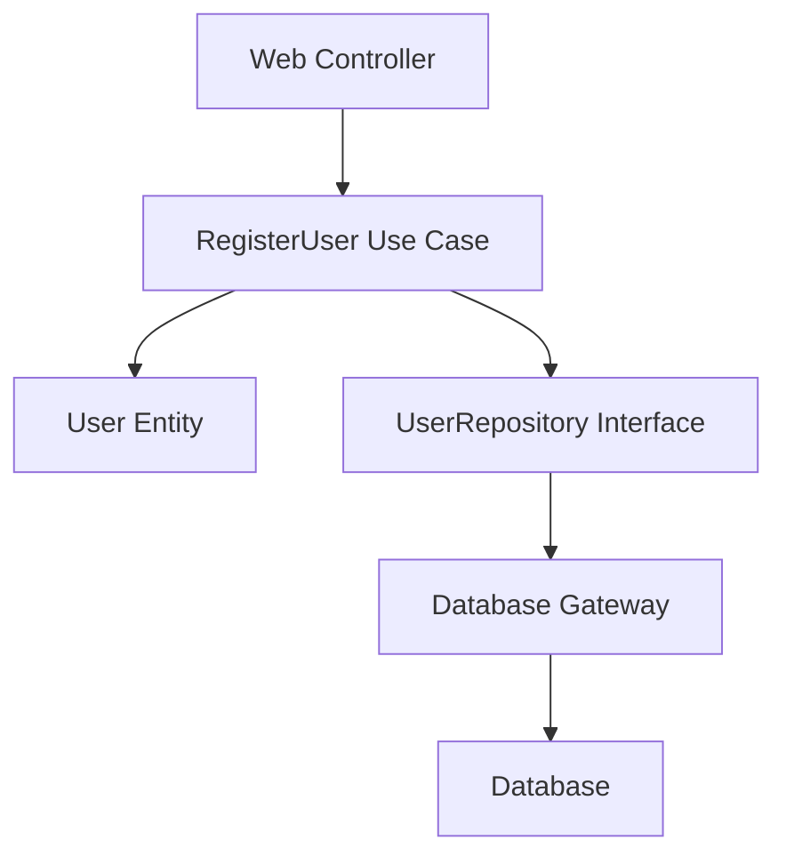
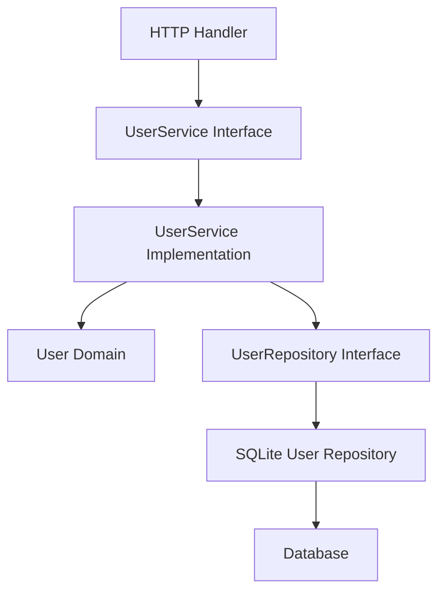
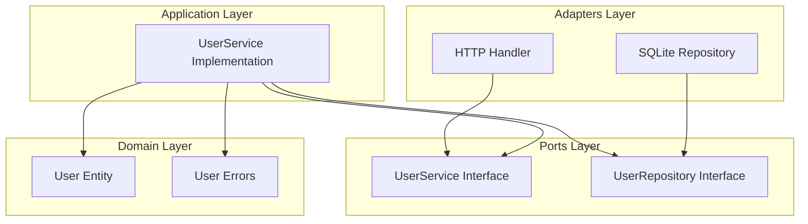

# Clean Architecture vs Hexagonal Architecture: A Junior Dev Guide

## Introduction

As a junior developer, understanding software architecture patterns can be overwhelming. This guide explains **Clean Architecture** and compares it with **Hexagonal Architecture** (which our forum project uses). We'll use simple diagrams and examples to make these concepts clear.

## What is Clean Architecture?

Clean Architecture is a layered architectural pattern created by Robert C. Martin (Uncle Bob). It emphasizes:

- **Separation of Concerns**: Each layer has a specific responsibility
- **Dependency Inversion**: High-level modules don't depend on low-level modules
- **Testability**: Business logic is isolated from external dependencies
- **Framework Independence**: Your core business logic doesn't depend on frameworks

### The Four Layers of Clean Architecture

``` text
┌─────────────────────────────────────┐
│           Frameworks & Drivers      │  ← Web, DB, External APIs
│           (Outer Layer)             │
├─────────────────────────────────────┤
│         Interface Adapters          │  ← Controllers, Gateways
├─────────────────────────────────────┤
│            Use Cases                │  ← Application Business Rules
│         (Application Layer)         │
├─────────────────────────────────────┤
│             Entities                │  ← Enterprise Business Rules
│          (Inner Layer)             │
└─────────────────────────────────────┘
```

## Checklist for junior developers

Use this quick checklist to validate your design and implementations:

- Can I test core business logic without a database or external API? (unit tests for domain and application services)
- Can I implement or swap an adapter (e.g. SQLite -> Postgres) without changing domain logic? (adapter tests + wiring)
- Are dependencies pointing inward (adapters -> ports -> application -> domain)? If you import an implementation directly into another module, refactor to depend on the port instead.

**Dependencies always point inward** - outer layers depend on inner layers, but inner layers don't depend on outer layers.
 
_Note: different authors interpret Clean Architecture slightly differently — some place interfaces alongside use cases while others put them closer to the domain. The key idea that dependencies point inward remains the same._
## How Our Forum Uses Hexagonal Architecture

Our forum project uses **Hexagonal Architecture** (also called Ports & Adapters). Here's how it works:

``` text
┌─────────────────────────────────────┐
│          External Actors            │  ← Users, APIs, Databases
├─────────────────────────────────────┤
│             Adapters                │  ← HTTP Handlers, Repositories
├─────────────────────────────────────┤
│              Ports                  │  ← Interfaces (Service, Repository)
├─────────────────────────────────────┤
│            Application              │  ← Business Logic (Services)
├─────────────────────────────────────┤
│             Domain                │  ← Core Business Rules
│    (Domain core (inner hexagon))   │
└─────────────────────────────────────┘
```
└─────────────────────────────────────┘


**Dependency Inversion**: The domain defines interfaces (ports) that external systems implement through adapters.

## Key Differences: Clean vs Hexagonal

### 1. **Dependency Direction**

**Clean Architecture:**

```text
Entities ← Use Cases ← Interface Adapters ← Frameworks
   ↑           ↑              ↑              ↑
Inner       Middle        Outer         Outermost
```

**Hexagonal Architecture:**

```text
Domain ← Application ← Ports ← Adapters ← External Systems
   ↑         ↑          ↑        ↑            ↑
Inner     Inner      Inner    Outer        Outermost
```

### 2. **Interface Ownership**

- **Clean Architecture**: Interfaces are often defined together with use cases (the application layer). Different authors interpret this differently — some place interfaces with use cases while others keep them adjacent to the domain.
- **Hexagonal Architecture**: Interfaces (Ports) are part of the inner boundary near the domain. In this project they live in a dedicated `ports/` package adjacent to `domain/` (for example `internal/modules/user/ports`). Ports define contracts using domain types; adapters implement those ports.

### 3. **Naming Convention**

- **Clean Architecture**: Uses "Use Cases" for application logic
- **Hexagonal Architecture**: Uses "Application Services" and emphasizes "Ports & Adapters"

## Real Example: User Registration

### Clean Architecture Approach



**Dependencies**: Controller → Use Case → Entity + Repository Interface → Gateway → Database

### Hexagonal Architecture Approach (Our Current System)



**Dependencies**: Handler → Service Port → Service Implementation → Domain + Repository Port → Repository Adapter → Database

In this repository these typically map to concrete paths:

- Port (interface): `internal/modules/<module>/ports/*.go` (e.g. `internal/modules/user/ports/service.go`)
- Application service implementation: `internal/modules/<module>/application/*.go` (e.g. `internal/modules/user/application/service.go`)
- Repository adapter (DB): `internal/modules/<module>/adapters/*.go` (e.g. `internal/modules/user/adapters/sqlite_user_repository.go`)
- Wiring / DI: `cmd/forum/wire/*` (where services, repos and handlers are constructed and connected)

## Why Hexagonal Architecture for Our Forum?

### Advantages for Our Project

1. **Technology Agnostic**: Easy to swap databases, web frameworks, or APIs
2. **Testability**: Mock adapters for unit testing business logic
3. **Parallel Development**: Teams can work on different adapters simultaneously
4. **Clear Boundaries**: Domain logic is protected from external changes

### Real-World Benefits

- **Database Migration**: Switch from SQLite to PostgreSQL by implementing a new adapter
- **API Changes**: Add GraphQL API without changing business logic
- **Testing**: Test user registration without touching the database

## Common Junior Dev Questions

### Q: "When should I use Clean Architecture?"

A: Use Clean Architecture for enterprise applications where you want strict layer separation and don't want frameworks to influence your business logic.

### Q: "When should I use Hexagonal Architecture?"

A: Use Hexagonal Architecture when you need to isolate your core business logic from external systems and want flexibility in technology choices.

### Q: "What's the difference between a Port and an Adapter?"

A: A **Port** is an interface that defines how your application interacts with the outside world. An **Adapter** is the implementation of that interface.

**Example:**

```go
// Port (Interface)
type UserRepository interface {
    CreateUser(user *User) error
    GetUserByID(id int) (*User, error)
}

// Adapter (Implementation)
type SQLiteUserRepository struct {
    db *sql.DB
}

func (r *SQLiteUserRepository) CreateUser(user *User) error {
    // SQLite implementation
}
```

### Q: "How do I know if I'm doing it right?"

A: Ask yourself:

- Can I test my business logic without databases/external APIs?
- Can I change my web framework without affecting business rules?
- Are my dependencies pointing inward (from outer to inner layers)?

## Dependency Flow in Our Forum Modules

Here's how dependencies flow in our user module:



## Testing Strategy

### Unit Tests (Inner Layers)

- Test domain entities and business rules
- Mock external dependencies (repositories, external APIs)

### Integration Tests (Outer Layers)

- Test adapters with real databases/external systems
- Verify that ports and adapters work together

### Example Test Structure

```text
tests/
├── unit/           # Test domain + application logic
├── integration/    # Test adapters + external systems
└── e2e/            # Test complete user journeys
```

## Migration Path: From Clean to Hexagonal

If you were converting a Clean Architecture project to Hexagonal:

1. **Move Interfaces**: Move repository interfaces from Use Cases to Domain
2. **Rename Layers**: Use Cases → Application Services
3. **Add Ports**: Explicitly define ports between layers
4. **Create Adapters**: Implement adapters for each external system

## Summary

- **Clean Architecture**: Strict layered approach with use cases owning interfaces
- **Hexagonal Architecture**: Domain-centric with ports and adapters for flexibility
- **Our Forum**: Uses Hexagonal Architecture for maintainability and testability
- **Key Principle**: Dependencies point inward, business logic is protected

Remember: Architecture patterns are tools, not rules. Choose what fits your project's needs and team preferences!
