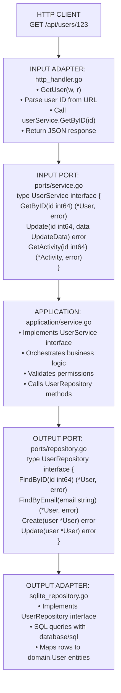
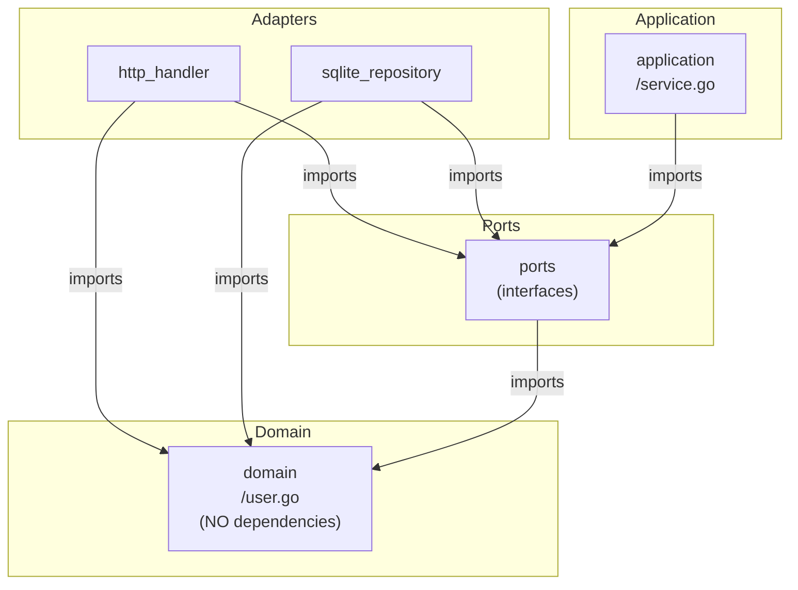

# User Module - Information Flow

## Overview

The **user** module manages user profiles, roles, and user-related operations using hexagonal architecture.

## Module Structure

```text
user/
├── domain/          # User entity and business rules
├── ports/           # Service and repository interfaces
├── application/     # Business logic orchestration
└── adapters/        # HTTP handlers and database access
```

## Information Flow

### Request Flow (Get User Profile Example)

```text
1. HTTP Request: GET /api/users/123
   ↓
2. INPUT ADAPTER (http_handler.go)
   - Extract user ID from URL
   - Call service.GetByID(123)
   ↓
3. INPUT PORT (ports/service.go)
   - UserService.GetByID(id)
   ↓
4. APPLICATION (application/service.go)
   - Implements UserService
   - Calls repository
   ↓
5. OUTPUT PORT (ports/repository.go)
   - UserRepository.FindByID(id)
   ↓
6. OUTPUT ADAPTER (sqlite_repository.go)
   - Execute SQL: SELECT * FROM users WHERE id = ?
   ↓
7. DOMAIN (domain/user.go)
   - User entity with role, email, etc.
   ↓
8. Response flows back
   ↓
9. HTTP Response: JSON user profile
```

## Detailed Architecture Diagram



## Dependency Flow

Direction: Everything depends on DOMAIN (center of hexagon)



## Key Components Explained

### Domain Layer (domain/)

**user.go**:

- User entity with fields: ID, Username, Email, Password (hashed), Role, CreatedAt, UpdatedAt
- Business rules: Email validation, username constraints
- Role enum: Guest, User, Moderator, Administrator

**errors.go**:

- Domain-specific errors: `ErrUserNotFound`, `ErrDuplicateEmail`, `ErrInvalidRole`

### Ports Layer (ports/)

**service.go** (INPUT PORT):

- Defines what operations the application provides
- Methods: GetByID, GetByEmail, Update, GetActivity, UpdateRole

**repository.go** (OUTPUT PORT):

- Defines how data is accessed
- Methods: FindByID, FindByEmail, Create, Update, Delete

### Application Layer (application/)

**service.go**:

- Implements UserService interface
- Contains business logic: permission checks, validation
- Orchestrates between domain and repository

Example logic:

```text
UpdateRole(userID, newRole):
  1. Get user from repository
  2. Check if caller has permission (domain logic)
  3. Update role (domain method)
  4. Save to repository
  5. Return result
```

### Adapters Layer (adapters/)

**http_handler.go** (INPUT ADAPTER):

- HTTP endpoints: GET /users/:id, PUT /users/:id, GET /users/:id/activity
- Parses requests, calls service methods
- Formats responses as JSON

**sqlite_repository.go** (OUTPUT ADAPTER):

- SQL queries to interact with `users` table
- Row scanning into domain.User structs
- Error handling and conversion

## Data Flow Examples

### Example 1: Update User Profile

```text
PUT /api/users/123
{username: "newname", bio: "New bio"}
         ↓
http_handler.UpdateUser()
    • Parse JSON body
    • Extract user ID
         ↓
userService.Update(123, updateData)
    • Fetch existing user
    • Validate permissions (is caller = user?)
    • Apply updates
         ↓
userRepo.Update(user)
    • SQL: UPDATE users SET username=?, bio=?, updated_at=? WHERE id=?
         ↓
domain.User (updated entity)
         ↓
200 OK response
```

### Example 2: Get User Activity

```text
GET /api/users/123/activity
         ↓
http_handler.GetActivity()
         ↓
userService.GetActivity(123)
    • Get user's posts (via post module)
    • Get user's comments (via comment module)
    • Get user's reactions (via reaction module)
    • Aggregate into Activity struct
         ↓
200 OK {posts: [...], comments: [...], reactions: [...]}
```

## Cross-Module Communication

User module may need data from other modules:

```text
userService.GetActivity(userID)
    ↓
postService.GetByUserID(userID)    ← Via ports.PostService interface
    ↓
commentService.GetByUserID(userID) ← Via ports.CommentService interface
    ↓
reactionService.GetByUserID(userID) ← Via ports.ReactionService interface
```

**Key**: Always communicate via service interfaces (INPUT PORTS), never directly with repositories.

## Why This Architecture?

1. **Testability**: Mock UserRepository for testing service logic
2. **Swappable Storage**: Change SQLite → Postgres by replacing only sqlite_repository.go
3. **Clear Boundaries**: Each layer has a single responsibility
4. **Domain Focus**: Core business logic has zero external dependencies

## Module Dependencies

User module imports:

- ✅ `platform/database` - Database connection
- ✅ `platform/logger` - Logging
- ✅ Other module ports (for cross-module communication)

User module does NOT import:

- ❌ Other module adapters or applications (only ports)

---

## Detailed Walk-Through: Get User Activity (For Junior Developers)

This shows **exact files**, **functions**, and **cross-module calls** to aggregate user activity.

### Where Are API Routes Registered?

**File: `/home/ertval/code/zone-modules/forum/internal/modules/user/adapters/http_handler.go`**

```go
func (h *Handler) RegisterRoutes(mux *http.ServeMux) {
    mux.HandleFunc("GET /api/users/{id}", h.GetUser)              // Get profile
    mux.HandleFunc("PUT /api/users/{id}", h.UpdateUser)           // Update profile
    mux.HandleFunc("GET /api/users/{id}/activity", h.GetActivity) // Get activity ← This one!
}
```

### Complete Flow: Get User Activity (Cross-Module Example)

**Scenario**: Get all activity for User 456 (their posts, comments, reactions).

#### Step 1: HTTP Request

```text
GET /api/users/456/activity
```

**File: `internal/modules/user/adapters/http_handler.go`**

```go
func (h *Handler) GetActivity(w http.ResponseWriter, r *http.Request) {
    // Extract user ID from URL
    userID, err := strconv.ParseInt(r.PathValue("id"), 10, 64)
    if err != nil {
        http.Error(w, "Invalid user ID", http.StatusBadRequest)
        return
    }
    
    // Call service
    activity, err := h.service.GetActivity(r.Context(), userID)
    if err != nil {
        h.handleError(w, err)
        return
    }
    
    // Return JSON
    w.WriteHeader(http.StatusOK)
    json.NewEncoder(w).Encode(activity)
}
```

#### Step 2: Service Aggregates Data from Multiple Modules

**File: `internal/modules/user/application/service.go`**

```go
type service struct {
    userRepo        ports.UserRepository
    postService     postports.PostService      // Post module port
    commentService  commentports.CommentService // Comment module port
    reactionService reactionports.ReactionService // Reaction module port
    logger          *logger.Logger
}

type Activity struct {
    User      *domain.User
    Posts     []*postdomain.Post
    Comments  []*commentdomain.Comment
    Reactions []*reactiondomain.Reaction
}

func (s *service) GetActivity(ctx context.Context, userID int64) (*Activity, error) {
    // 1. Get user info
    user, err := s.userRepo.FindByID(ctx, userID)
    if err != nil {
        return nil, err
    }
    
    // 2. Get user's posts (CROSS-MODULE CALL)
    posts, err := s.postService.GetByUserID(ctx, userID)
    if err != nil {
        s.logger.Error("Failed to get user posts", logger.Error(err))
        posts = []*postdomain.Post{} // Continue with empty list
    }
    
    // 3. Get user's comments (CROSS-MODULE CALL)
    comments, err := s.commentService.GetByUserID(ctx, userID)
    if err != nil {
        s.logger.Error("Failed to get user comments", logger.Error(err))
        comments = []*commentdomain.Comment{}
    }
    
    // 4. Get user's reactions (CROSS-MODULE CALL)
    reactions, err := s.reactionService.GetByUserID(ctx, userID)
    if err != nil {
        s.logger.Error("Failed to get user reactions", logger.Error(err))
        reactions = []*reactiondomain.Reaction{}
    }
    
    return &Activity{
        User:      user,
        Posts:     posts,
        Comments:  comments,
        Reactions: reactions,
    }, nil
}
```

#### Step 3: Post Module Returns User's Posts

**File: `internal/modules/post/application/service.go`**

```go
func (s *service) GetByUserID(ctx context.Context, userID int64) ([]*domain.Post, error) {
    return s.postRepo.FindByUserID(ctx, userID)
}
```

**File: `internal/modules/post/adapters/sqlite_repository.go`**

```go
func (r *sqlitePostRepository) FindByUserID(ctx context.Context, userID int64) ([]*domain.Post, error) {
    query := `
        SELECT id, user_id, title, content, image_path, created_at, updated_at
        FROM posts
        WHERE user_id = ?
        ORDER BY created_at DESC
    `
    
    rows, err := r.db.QueryContext(ctx, query, userID)
    if err != nil {
        return nil, err
    }
    defer rows.Close()
    
    var posts []*domain.Post
    for rows.Next() {
        var post domain.Post
        if err := rows.Scan(&post.ID, &post.UserID, &post.Title, &post.Content, 
                           &post.ImagePath, &post.CreatedAt, &post.UpdatedAt); err != nil {
            return nil, err
        }
        posts = append(posts, &post)
    }
    
    return posts, nil
}
```

### Summary: Function Call Chain

```text
1. GET /api/users/456/activity
   ↓
2. user/adapters/http_handler.go → GetActivity(w, r)
   ↓
3. user/application/service.go → GetActivity(ctx, 456)
   ↓
   ├→ user/adapters/sqlite_repository.go → FindByID(ctx, 456)
   │  SQL: SELECT * FROM users WHERE id = 456
   │
   ├→ CROSS-MODULE: post/application/service.go → GetByUserID(ctx, 456)
   │  ↓
   │  post/adapters/sqlite_repository.go → FindByUserID(ctx, 456)
   │  SQL: SELECT * FROM posts WHERE user_id = 456
   │
   ├→ CROSS-MODULE: comment/application/service.go → GetByUserID(ctx, 456)
   │  ↓
   │  comment/adapters/sqlite_repository.go → FindByUserID(ctx, 456)
   │  SQL: SELECT * FROM comments WHERE user_id = 456
   │
   └→ CROSS-MODULE: reaction/application/service.go → GetByUserID(ctx, 456)
      ↓
      reaction/adapters/sqlite_repository.go → FindByUserID(ctx, 456)
      SQL: SELECT * FROM reactions WHERE user_id = 456
   ↓
4. Aggregate all data into Activity struct
   ↓
5. Return JSON response with user's complete activity
```

### How Dependencies Are Wired

**File: `cmd/forum/wire/services.go`**

```go
func initUserService(
    userRepo ports.UserRepository,
    postService postports.PostService,        // Injected
    commentService commentports.CommentService, // Injected
    reactionService reactionports.ReactionService, // Injected
    logger *logger.Logger,
) ports.UserService {
    return user.NewService(userRepo, postService, commentService, reactionService, logger)
}
```

**Key Points**:

- User service receives interfaces from other modules
- It can call their methods to aggregate data
- No direct dependencies on implementations
- Easy to test with mocked interfaces
